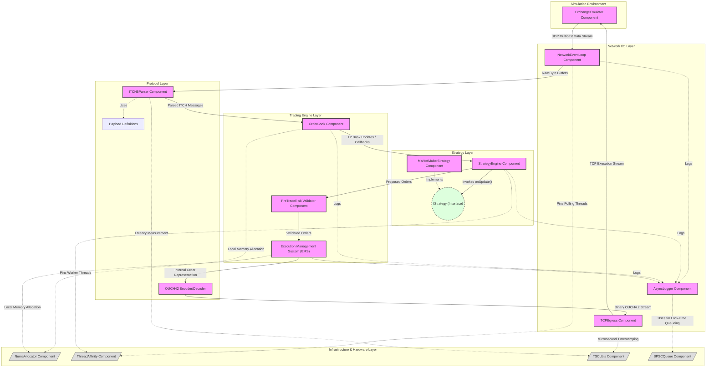

# Component Diagram

This document contains the component diagram for the `numa-portfolio` project, illustrating the logical grouping of components, their responsibilities, and how data and control flow between them across various architectural layers.

## Component Descriptions

### Simulation Environment
*   **ExchangeEmulator**: Simulates the Nasdaq exchange by publishing ITCH 5.0 market data via UDP multicast and listening for OUCH 4.2 orders via TCP. Used for local testing and benchmarking.

### Network I/O Layer
*   **NetworkEventLoop**: High-performance, epoll-based network event loop responsible for reading incoming market data UDP packets.
*   **TCPEgress**: Handles low-latency outbound TCP connections to send order packets to the exchange.
*   **AsyncLogger**: A lock-free, asynchronous logging component that moves I/O operations off the critical path.

### Protocol Layer
*   **ITCH5Parser**: Parses raw ITCH 5.0 multicast packets into structural market data updates.
*   **OUCH42**: Encodes internal order representations into the binary OUCH 4.2 protocol format for exchange submission.
*   **Payload**: Core data structures defining messages (e.g., Add Order, Cancel, Execute).

### Trading Engine Layer
*   **OrderBook**: Maintains the real-time Limit Order Book (L2 state). Reconstructs the book based on ITCH messages.
*   **PreTradeRisk**: Validates proposed orders (e.g., fat-finger checks, max order size, position limits) before they reach the execution phase.
*   **Execution Management System (EMS)**: Manages local state of active orders, handles order lifecycle, and interfaces with the OUCH protocol encoder.

### Strategy Layer
*   **StrategyEngine**: The core orchestration engine. It listens to the `OrderBook` and invokes loaded strategies upon market data updates.
*   **IStrategy**: Abstract interface that any trading strategy must implement.
*   **MarketMakerStrategy**: A specific implementation of `IStrategy` that generates two-sided quotes based on order book changes.

### Infrastructure & Hardware Layer
*   **NumaAllocator**: Custom memory allocator that ensures memory is allocated on the correct NUMA node, preventing cross-NUMA latency hits.
*   **ThreadAffinity**: Utility for pinning specific threads (e.g., the network polling thread, strategy thread) to dedicated CPU cores.
*   **TSCUtils**: Time Stamp Counter utility used for ultra-low latency timing and telemetry.
*   **SPSCQueue**: Single-Producer Single-Consumer lock-free ring buffer, used heavily by the `AsyncLogger` and inter-thread messaging.
