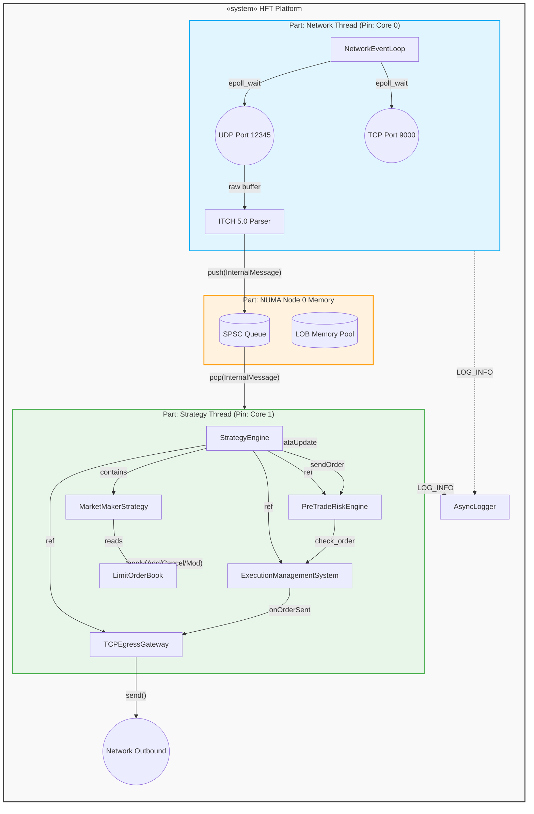
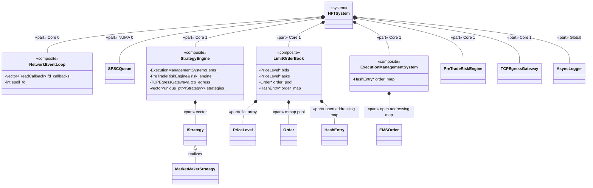

# Composite Structure Diagram: HFT System

A Composite Structure Diagram illustrates the internal structure of a class or component, including its parts, ports, and connectors. Below is the Mermaid representation of the `numa-portfolio` project's internal structure.

## 1. Component Internal Wiring (Parts & Connectors)

This diagram focuses on the runtime instantiation of parts (components/objects) within the main system, and the connectors (queues, sockets, method calls) that wire them together.

## 2. UML Composite Structure via Class Diagram

This diagram explicitly uses UML composition (`*--`) to demonstrate how the global `HFTSystem` is composed of its constituent parts, and how those parts are internally structured with their own sub-parts.

