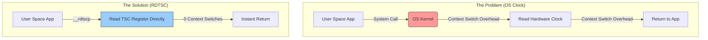

# Benchmarking Hardware Latency

To accurately measure the performance of our SPSC ring buffer, we must measure sub-microsecond latencies. When testing the performance of a software system, developers typically use standard libraries like `std::chrono` in C++ or `System.nanoTime()` in Java. 

While these libraries are great for measuring web requests or database queries that take milliseconds, they are heavily flawed when trying to measure a system that operates in single-digit nanoseconds.

## 1. The Overhead of OS Clocks

Standard time libraries inevitably call down to the Operating System (e.g., `clock_gettime` in Linux). Calling into the OS Kernel incurs a context switch penalty. If your Queue operation takes 50 nanoseconds, but asking the OS for the current time takes 150 nanoseconds, your benchmark is completely skewed. You are measuring the overhead of the stopwatch, not the speed of the runner.



## 2. The Time Stamp Counter (TSC)

Instead of asking the OS, we bypass standard clocks entirely and ask the CPU directly. Modern processors have a hardware register called the **Time Stamp Counter (TSC)**. It increments by 1 every single CPU cycle.

To read it, we use a low-level intrinsic function called `__rdtscp()`.

### The Magic of `__rdtscp`
There is a slightly older function called `__rdtsc()`, but it has a massive vulnerability: aggressive CPU instruction reordering. The CPU might execute the `__rdtsc()` instruction *before* it actually executes your code, completely ruining your measurement.

`__rdtscp()` solves this by acting as a strict execution barrier. The CPU guarantees that all previous instructions have fully completed before it reads the cycle counter, giving us flawless precision.

```cpp
inline uint64_t read_tsc() {
    unsigned int aux;
    return __rdtscp(&aux);
}
```

## 3. Converting Cycles to Nanoseconds

The TSC gives us raw hardware cycles. To convert this to a human-readable time (nanoseconds), we need to know the exact frequency of the CPU.

If a CPU runs at 2.0 GHz (2 billion cycles per second), then 1 cycle takes exactly 0.5 nanoseconds. By estimating the TSC frequency against a standard clock over a long duration (e.g., 100ms) at the start of the benchmark, we can accurately convert raw cycle deltas into nanoseconds.

## 4. Test Environment Setup

We run two identical test binaries to observe the "Latency Cliff" associated with NUMA architecture. Using our `ThreadAffinity` and `NumaAllocator` wrappers, we configure the tests as follows:

- **Test A (Local NUMA):** Both the Producer and Consumer threads are pinned to logical cores on the *same* NUMA node. The SPSC queue memory is explicitly allocated on that exact node.
- **Test B (Cross-NUMA):** The threads are pinned to cores on different nodes, or one core is forced to cross the QPI/UPI interconnect to read the other node's memory.

The next chapter visualizes the results of pushing 1,000,000 messages through these two setups.
