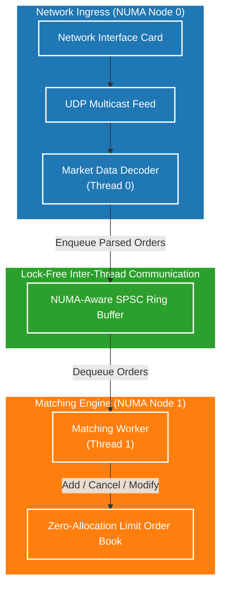

# End-to-End System Architecture

To truly understand how the components of this project fit together, we need to look at the "Big Picture" system design. High-Frequency Trading (HFT) systems require multiple components working in perfect harmony, typically broken down into networking, message decoding, order routing, and order matching.

This project focuses on the boundary between message ingress and order matching.

## The Architecture Diagram

The system uses a producer-consumer model bridging network thread(s) and matching engine thread(s). The core bridging data structure is the **NUMA-Aware SPSC Ring Buffer**, and the core matching engine is the **Zero-Allocation Limit Order Book (LOB)**.

## Component Synergy

### 1. Network Ingress & Decoder (Producer)
In a real-world scenario, market data arrives via UDP multicast. A dedicated thread (pinned to a core close to the NIC) is responsible for reading the raw packets, decoding the financial protocol (like FIX or ITCH), and translating it into internal `Order` structs. 

Because decoding is IO-bound and networking-heavy, it runs on its own thread.

### 2. NUMA-Aware SPSC Ring Buffer (Transport)
Once the message is parsed, it needs to be sent to the matching engine. We use a **Single-Producer Single-Consumer (SPSC)** lock-free ring buffer. 
- It is carefully allocated using `mmap` and `mbind` to be NUMA-aware, preventing cross-socket memory fetching overhead.
- It prevents the network thread from blocking on locks, ensuring we can drain the network socket as fast as possible to avoid dropping packets.

### 3. Zero-Allocation Limit Order Book (Consumer)
The consumer thread constantly polls the SPSC queue. When an order arrives, it applies it to the Limit Order Book.
- Because memory allocation (`new` / `delete`) requires kernel locks and is extremely slow, our LOB is **100% zero-allocation** on the critical path.
- It uses intrusive linked lists and pre-allocated memory pools.
- The thread is pinned to the correct NUMA node, allowing ultra-low latency L1/L2 cache hits when managing the order book data structures.

This design ensures strict isolation of concerns while maintaining nanosecond-level latency at every transition point.
