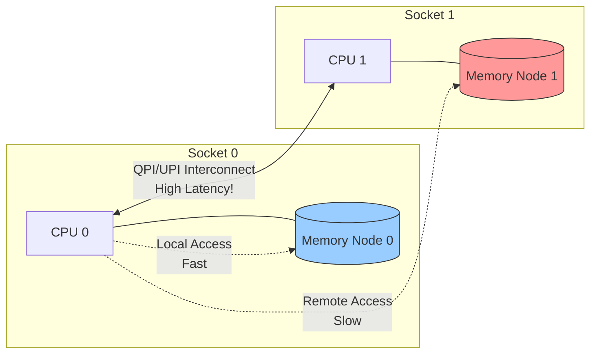
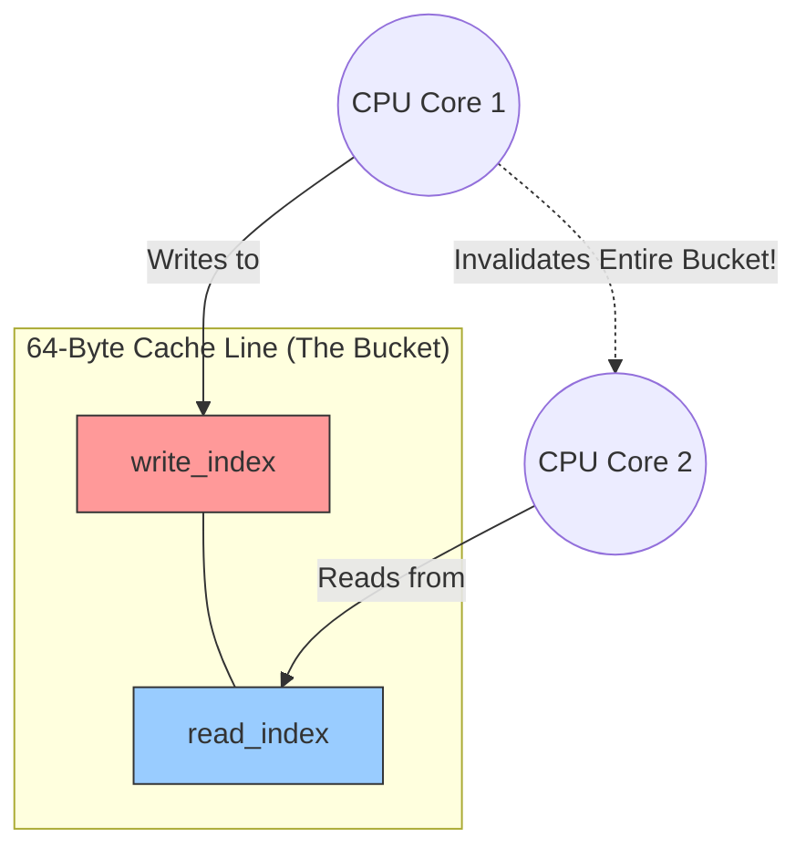

# Hardware Architecture & The Physical Reality

To write ultra-fast software, you must understand the physical hardware it runs on. The concept of **Mechanical Sympathy** means designing your software to align with the limitations and architectures of the hardware. This chapter explores the hidden mechanisms inside modern servers that dictate memory latency.

## 1. The Memory Hierarchy

A CPU does not read from main memory (RAM) directly when it can avoid it; RAM is incredibly slow compared to the CPU's processing speed. Instead, data is pulled through a hierarchy of caches.

*   **L1 Cache (Registers & Level 1):** The fastest memory, embedded directly into the CPU core. Access time is roughly **1-2 nanoseconds**. It is very small (often 32KB to 64KB per core).
*   **L2 Cache:** Larger than L1 (e.g., 256KB to 1MB per core), but slightly slower. Access time is roughly **3-5 nanoseconds**.
*   **L3 Cache (Last Level Cache - LLC):** Shared across all cores on a single CPU socket/node. It is much larger (e.g., 20MB+) but slower, taking roughly **10-20 nanoseconds**.
*   **Main Memory (Local RAM):** Accessing the RAM sticks physically attached to the CPU socket takes roughly **60-100 nanoseconds**.
*   **Main Memory (Remote RAM):** Accessing RAM attached to a *different* CPU socket over the interconnect (cross-NUMA) can take **120+ nanoseconds**.

Every time your thread experiences a "cache miss" (the data isn't in L1/L2/L3) and has to fetch from RAM, your program stalls.

## 2. NUMA Architecture & Interconnects

In modern enterprise servers, CPUs are highly powerful but physically bound by space. Large machines often have multiple physical CPU chips (Sockets) installed on the motherboard. They cannot all share the exact same physical wires to the RAM, because the data traffic would cause a massive bottleneck. 

Instead, RAM is divided into "Nodes" attached directly to a specific CPU Socket. This is **NUMA (Non-Uniform Memory Access)**. The speed at which you can access memory depends on where the memory physically lives.



If a thread on Node 0 requests memory located on Node 1, the request must travel over the **Intel QPI (QuickPath Interconnect)** or **UPI (UltraPath Interconnect)**. This bridge acts like a toll booth with finite bandwidth. If many threads communicate across nodes, the UPI link becomes congested, leading to massive tail latencies (jitter).

By pinning our threads (`pthread_setaffinity_np`) to specific logical cores, and using `libnuma` to explicitly allocate our ring buffer into the exact RAM node physically connected to those cores, we guarantee we stay entirely within the fastest possible hardware path.

## 3. The CPU Cache & False Sharing

When a CPU needs a piece of data, it doesn't read a single byte. It fetches a "block" of memory called a **Cache Line** (exactly 64 bytes on modern x86 processors). 

Imagine two threads running on two different CPU cores:
- **Core A** wants to modify a variable `write_index`.
- **Core B** wants to modify a variable `read_index`.

If we declare them consecutively in C++, they will likely end up in the exact same 64-byte Cache Line:
```cpp
std::atomic<size_t> write_index{0}; // 8 bytes
std::atomic<size_t> read_index{0};  // 8 bytes
```

### The MESI Protocol & False Sharing Catastrophe

Hardware implements a Cache Coherence protocol, the most common being **MESI** (Modified, Exclusive, Shared, Invalid). 



When Core A modifies `write_index`, the hardware must invalidate Core B's cache line (changing it to Invalid), force Core A to flush its changes, and force Core B to fetch it again. Even though Core B never cared about `write_index`—it only wanted `read_index`—it suffers a massive latency penalty. They are fighting over the same physical memory block. This is **False Sharing**.

To solve this, we explicitly put variables in separate cache lines using `alignas(64)`.

## 4. TLB and Huge Pages

When your program accesses memory, it uses "Virtual Addresses". The CPU must translate these to physical hardware addresses.

*   **TLB (Translation Lookaside Buffer):** A small, extremely fast hardware cache inside the MMU (Memory Management Unit) that stores recent virtual-to-physical translations.
*   **TLB Miss:** If the translation isn't in the TLB, the CPU must walk the "page tables" in RAM, which is very slow.
*   **Huge Pages:** By default, OS memory pages are 4KB. If your ring buffer is 1GB, that's 262,144 pages, easily overwhelming the TLB and causing constant TLB misses. Using "Huge Pages" (e.g., 2MB or 1GB pages) means the TLB can map massive amounts of memory with just one entry, significantly reducing latency.

*(Note: While our current SPSC queue focuses on cache-line padding and NUMA pinning, utilizing Huge Pages via `mmap` is the next critical step for scaling such systems.)*

## 5. CPU Pipelining & Out-of-Order Execution

A CPU doesn't process one instruction from start to finish before starting the next. It uses an assembly line (a pipeline) with Fetch, Decode, Execute, and Writeback stages.

What happens if an instruction gets stuck?
Imagine `Step 1` requires fetching an array from slow Main Memory (a cache miss). The CPU's pipeline stalls. Modern CPUs are too smart to sit idle. They look ahead at `Step 2`. If `Step 2` does not seemingly depend on the result of `Step 1` (from the perspective of that single thread), the CPU will actively execute Step 2 *before* Step 1 finishes. This is **Out-of-Order Execution (OoOE)**.

**The Catastrophe:**
```cpp
data_[current_write] = item;   // Step 1: Write the payload
write_index_ = next_write;     // Step 2: Update the flag
```
If the CPU reorders this, it updates the `write_index` flag before the payload is actually written to RAM. The Consumer thread sees the flag, reads the data array, and processes **garbage/uninitialized memory**. 

Understanding Out-of-Order execution is why software must explicitly enforce Memory Ordering using C++ Atomics, issuing Memory Fences to tell the CPU hardware and the compiler not to reorder critical instructions.
