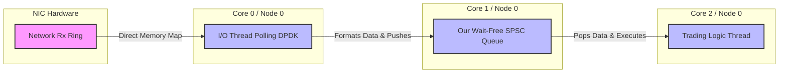

# Introduction & FinTech Context

Welcome to the NUMA-Aware Lock-Free SPSC Ring Buffer project. This documentation serves as a step-by-step guide for students and professionals to understand the theory, hardware realities, and system design behind an ultra-low-latency inter-thread communication mechanism used in High-Frequency Trading (HFT).

## Hardware Specification

To ensure absolute clarity regarding the performance metrics demonstrated in this project, all benchmarks and tests were executed on the following dedicated hardware topology:
- **CPU**: Dual Intel(R) Xeon(R) Silver 4110 CPU @ 2.10GHz
- **Architecture**: 2 Sockets (NUMA Nodes), 8 Physical Cores per Socket (16 Threads via Hyper-Threading). Total: 32 Logical Cores.
- **Memory**: 96 GB Total (48 GB per NUMA Node).
- **NUMA Distances**: Local access (10), Cross-node access over UPI interconnect (21).
- **L3 Cache**: 22 MiB per socket.

## Core Concepts

### What is NUMA?
Non-Uniform Memory Access (NUMA) is a computer memory design used in multiprocessing, where the memory access time depends on the memory location relative to the processor. Under NUMA, a processor can access its own local memory faster than non-local memory. In HFT, ignoring NUMA can lead to significant latency spikes.

### What is SPSC?
Single-Producer Single-Consumer (SPSC) refers to a thread-safe queue where exactly one thread writes to the queue and exactly one thread reads from it. Because the producer and consumer are strictly 1:1, we can implement entirely lock-free operations using standard atomics, completely avoiding expensive OS-level mutexes or semaphores.

## The Purpose of this Project

The primary purpose of this project is to build a **deterministic, ultra-low-latency inter-thread communication mechanism**. 

In standard software engineering, when two threads need to share data, they use a `std::mutex` (a lock). If Thread A is writing, Thread B must sleep until Thread A is finished. In web development, a thread sleeping for 50 microseconds is unnoticeable. In High-Frequency Trading, a 50-microsecond delay means a competitor executes a trade before you. You lose the opportunity, and potentially millions of dollars over a year. The purpose of this project is to allow threads to share data in **nanoseconds** (billionths of a second) without ever sleeping or locking.

This system is a **Wait-Free, Lock-Free, NUMA-Aware Single-Producer Single-Consumer (SPSC) Ring Buffer**:
*   **Wait-Free:** Every thread finishes its operation in a bounded, predictable number of CPU cycles. No thread is ever forced to wait for another.
*   **NUMA-Aware:** It explicitly allocates its memory on the physical RAM sticks closest to the CPU cores executing the threads.
*   **SPSC:** It strictly enforces that only one specific thread can write to the queue, and only one specific thread can read from it.

## How it Fits into the HFT Ecosystem

An HFT trading bot is generally split into isolated, highly specialized threads pinned to specific CPU cores. But where does the data come from? Typically, it comes from a network (e.g., a stock exchange market data feed via UDP).

### The Standard Networking Path vs Kernel Bypass
When a UDP packet arrives at your server's Network Interface Card (NIC), standard OS processing incurs hardware interrupts, context switches, and data copying between Kernel Space and User Space. This process takes anywhere from 5 to 50 **microseconds** and introduces massive OS Jitter.

To achieve nanosecond latency, firms use **Kernel Bypass** (like DPDK or Solarflare). The NIC's hardware memory buffers are directly mapped into the User Space memory of the C++ application. The application thread no longer goes to sleep; it constantly polls the memory buffer to see if a new packet has arrived.

### The Full HFT Architecture
When you combine Kernel Bypass with our SPSC Queue, you get the standard architecture for an ultra-low-latency trading bot:

**The Flow:**
1. The **I/O Thread** spins on Core 0, reading packets directly from the NIC via Kernel Bypass (latency: ~1-2 microseconds).
2. It quickly deserializes the packet and pushes the struct into our **SPSC Queue** on Core 1 (latency: ~10-15 nanoseconds).
3. The **Trading Logic Thread** spins on Core 2, instantly reading the message and making a trading decision.

Firms like Citadel, Optiver, and Jane Street employ hundreds of engineers to shave nanoseconds off this path. They use systems like this because of its perfect **Determinism (Zero Jitter)**, **Mechanical Sympathy** with the CPU cache, and the elimination of garbage collection via static pre-allocation.
