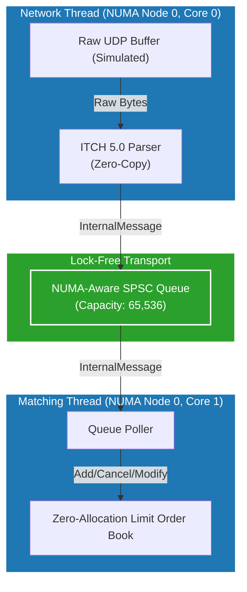

# End-to-End System Design: ITCH 5.0 to LOB

This section details the complete, integrated architecture of the High-Frequency Trading (HFT) pipeline built in this repository. It traces the journey of a market data packet from its raw binary form, through our NUMA-aware inter-thread transport, to its final resting place in our Zero-Allocation Limit Order Book (LOB).

## 1. The Big Picture

The repository combines three distinct ultra-low latency components into a single cohesive pipeline:
1. **Network Ingress & ITCH 5.0 Decoder**: Parses raw exchange byte streams without allocations or copies.
2. **NUMA-Aware SPSC Ring Buffer**: A lock-free, wait-free transport mechanism specifically aligned to CPU caches and memory nodes.
3. **Zero-Allocation Limit Order Book**: A highly optimized matching structure utilizing pre-allocated memory pools, flat arrays, and intrusive doubly-linked lists.

---

## 2. Component Details

### A. The ITCH 5.0 Protocol Decoder

Real-world exchanges (like NASDAQ) broadcast market data using binary protocols such as ITCH 5.0. To achieve microsecond latency, parsing must be deterministic and allocation-free.

**Design Highlights:**
- **`#pragma pack(push, 1)`**: We define C++ structs for ITCH messages (e.g., `AddOrderMsg`, `OrderExecutedMsg`) tightly packed with no padding. This allows the parser to cast a raw `uint8_t*` buffer directly to a struct pointer (`reinterpret_cast`).
- **Zero-Copy**: The bytes are never copied into an intermediate string or buffer. We read directly from the network payload.
- **Intrinsic Byte-Swapping**: Network protocols use Big-Endian formatting. x86 CPUs use Little-Endian. We use GCC compiler intrinsics (`__builtin_bswap32`, `__builtin_bswap64`) which compile down to single-cycle `bswap` assembly instructions.

### B. The NUMA-Aware SPSC Queue

Once the `ITCH5Parser` translates an exchange message into our unified `InternalMessage` format, it must hand it off to the trading thread.

**Design Highlights:**
- **Lock-Free**: We use C++11 `std::atomic` with `memory_order_acquire` and `memory_order_release` semantics. There are no mutexes or context switches.
- **Cache-Line Alignment**: The read index, write index, and data array are aligned to 64-byte boundaries (`alignas(64)`) to completely eliminate False Sharing.
- **NUMA Placement**: The memory for the queue is explicitly mapped to the NUMA node where the threads run using `mbind()`. This prevents the CPU from having to fetch memory across the QPI/UPI interconnect bus.

### C. The Zero-Allocation Limit Order Book (LOB)

The consumer thread drains the SPSC Queue and applies the updates to the LOB.

**Design Highlights:**
- **Memory Pools**: All `Order` nodes are pre-allocated in a giant `mmap` block at startup. Adding an order simply pops a pointer from a `free_list`.
- **Intrusive Lists**: Orders are kept in price-time priority using doubly-linked lists. By making the list "intrusive" (the `prev` and `next` pointers are inside the `Order` struct itself), we save a pointer dereference and maintain strict cache locality.
- **Pre-Allocated Hash Map**: For O(1) order lookups (required for processing Cancels and Executions), we use a flat, open-addressing hash map with linear probing.

---

## 3. High Churn Scenarios & System Behavior

Benchmarking a system with sequential "Add Order" messages provides a theoretical max throughput, but real HFT systems face extreme "churn". 

### The Cancel-Replace Storm
In modern markets, up to 90-95% of orders are canceled or modified within milliseconds of being placed. To test our architecture, the `ITCH_to_LOB_pipeline.cpp` mock generator produces a highly realistic data stream:
- **50% Adds** (`A` messages)
- **20% Executions** (`E` and `C` messages)
- **20% Partial Cancels** (`X` messages)
- **10% Full Deletes** (`D` messages)

### How the System Responds

1. **Adding an Order**: Fast and painless. The LOB pops an `Order` from the pool, appends it to the tail of the `PriceLevel` intrusive list, and inserts the `ID -> Order*` mapping into the Hash Map.
2. **Partial Executions and Cancels**: The LOB looks up the `Order*` in the Hash Map. It calls `modify()` to reduce the quantity. Because the quantity is strictly decreasing, the order *retains its time priority* and does not need to be unlinked from the list.
3. **Full Deletes**: The LOB looks up the `Order*`, unlinks it from the `PriceLevel`'s doubly-linked list (O(1) time complexity), marks the Hash Map entry with a `TOMBSTONE`, and returns the memory to the `free_list`.

### Microburst Handling
Market data arrives in explosive bursts. Because our SPSC queue has a large capacity (`65,536` elements) and uses a busy-wait spinloop (`while (!queue->push(msg))`), the Network Thread can immediately offload massive spikes of incoming UDP packets without dropping them. The Matching Thread acts as a shock absorber, draining the queue as fast as the L1 cache allows.

In our internal benchmarks, this E2E pipeline sustains throughputs of **~7-9 million messages per second** (parsing, inter-thread transport, and matching combined) on standard enterprise hardware.
