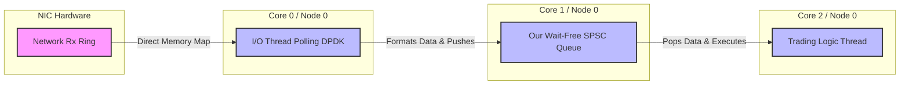

# Deep Dive: Kernel Bypass & OS Jitter

Our NUMA-aware SPSC queue can pass messages between threads in nanoseconds. But in a real-world system, where does that data come from? Typically, it comes from a network (e.g., a stock exchange market data feed via UDP). 

This lesson zooms out to look at the broader High-Frequency Trading (HFT) architecture and explains why standard networking ruins low-latency designs.

## 1. The Standard Networking Path
When a UDP packet arrives at your server's Network Interface Card (NIC), a massive chain of events occurs:
1.  **Hardware Interrupt:** The NIC sends an electrical signal to the CPU to pause what it's doing.
2.  **Context Switch:** The CPU saves the state of your application and switches into "Kernel Mode."
3.  **Kernel Processing:** The OS networking stack (TCP/IP stack) reads the packet, checks checksums, allocates memory (skb buffers), and figures out which application it belongs to.
4.  **Data Copy:** The packet is copied from Kernel Space memory into User Space memory.
5.  **Context Switch:** The CPU switches back to your application thread.

**The Problem:** This process takes anywhere from 5 to 50 **microseconds** (5,000 to 50,000 nanoseconds). Worse, the OS scheduler might decide to run a background process instead of returning to your app immediately, causing **OS Jitter** (latency spikes of milliseconds).

## 2. The Solution: Kernel Bypass
To utilize a nanosecond-scale queue, we must bypass the microsecond-scale Operating System. 

Technologies like **DPDK (Data Plane Development Kit)**, **Solarflare OpenOnload**, or Linux's **AF_XDP** allow applications to perform "Kernel Bypass."

*   **Memory Mapping:** The NIC's hardware memory buffers are directly mapped into the User Space memory of your C++ application.
*   **Polling, No Interrupts:** The application thread no longer goes to sleep waiting for an interrupt. Instead, it enters a `while(true)` loop, constantly polling the memory buffer to see if a new packet has arrived. (This is why HFT servers run at 100% CPU utilization 24/7).
*   **Zero-Copy:** The data is read directly from the NIC buffer without being copied by the OS.

## 3. The Full HFT Architecture
When you combine Kernel Bypass with our SPSC Queue, you get the standard architecture for an ultra-low-latency trading bot:

**The Flow:**
1. The **I/O Thread** spins on Core 0, reading packets directly from the NIC via Kernel Bypass (latency: ~1-2 microseconds).
2. It quickly deserializes the packet and pushes the struct into our **SPSC Queue** on Core 1 (latency: ~15 nanoseconds).
3. The **Trading Logic Thread** spins on Core 2, instantly reading the message and making a trading decision.

By isolating the I/O polling from the trading logic using a wait-free queue, neither thread blocks the other, ensuring deterministic, ultra-low latency.
