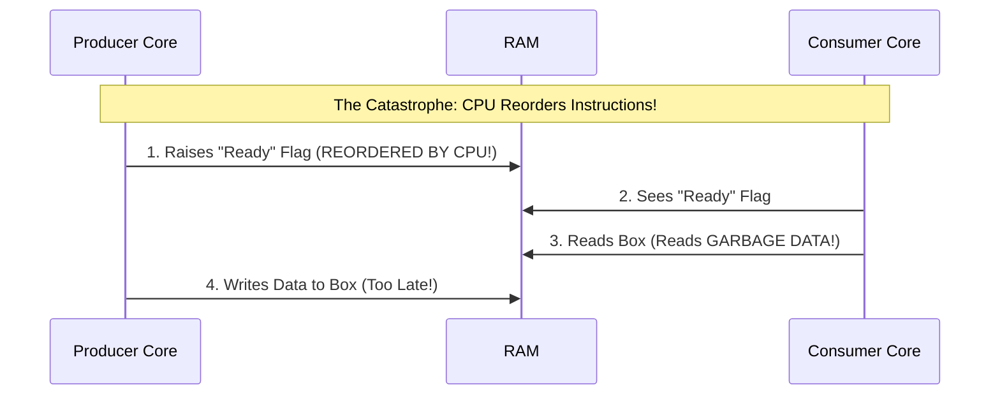
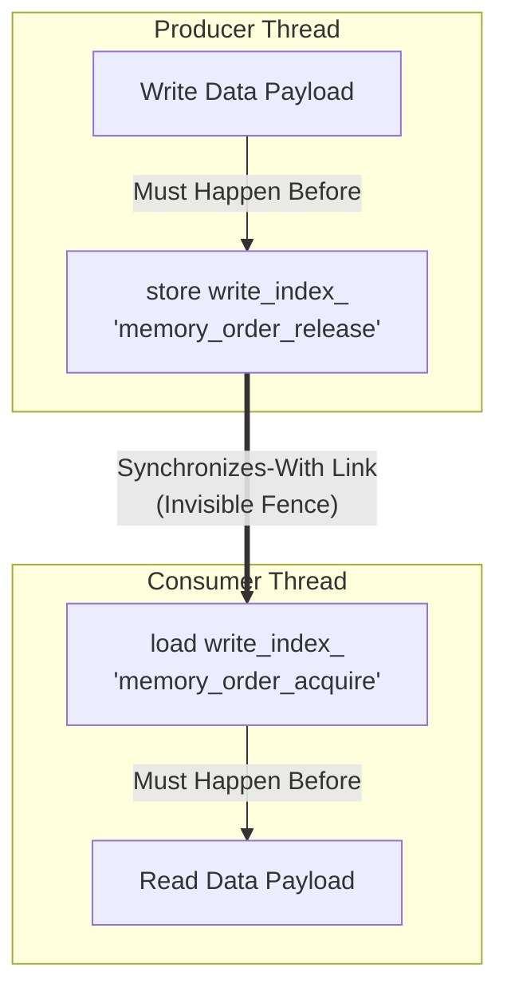

# Software Primitives & Concurrency

To overcome the hardware limitations discussed in the previous chapter, we must use precise software engineering techniques. This chapter explores the C++ concepts and concurrency primitives that allow our SPSC ring buffer to achieve wait-free progress.

## 1. Progress Guarantees (Wait-Freedom)

When building concurrent systems, "lock-free" is often used interchangeably with "fast," but computer science defines these with strict mathematical progress guarantees:

### Blocking Algorithms
Traditional multi-threading uses synchronization primitives like `std::mutex`. If Thread A acquires a lock and is preempted by the OS scheduler (put to sleep), Thread B blocks forever waiting for the lock. The entire system's progress halts.

### Non-Blocking: Lock-Free
Many high-performance queues rely on a `Compare-And-Swap` (CAS) operation in a `while` loop. The *system as a whole* makes progress, but a specific thread might fail its CAS loop thousands of times if other threads beat it. It is subject to starvation.

### Non-Blocking: Wait-Free (Our Architecture)
Wait-freedom is the strongest progress guarantee. *Every single thread* makes progress in a bounded number of steps, regardless of what any other thread is doing. 

Because we use a Single-Producer Single-Consumer (SPSC) design, exactly one thread modifies the `write_index_` and exactly one thread modifies the `read_index_`. There is no contention. We don't need CAS loops to resolve conflicts because conflicts are architecturally impossible. The operations complete in a fixed, predictable number of CPU cycles.

## 2. Atomics & Memory Ordering

In standard multi-threading, we often use `std::mutex` to prevent threads from talking over each other. A mutex asks the Operating System to put a thread to sleep if data is locked. In ultra-low-latency systems like HFT, going to the OS is simply too slow. 

Instead, we use C++'s `<atomic>` library to talk directly to the hardware.

### What is `std::atomic`?
When a variable is declared as `std::atomic<T>`, the C++ compiler and the CPU guarantee that reading or writing to this variable happens as a single, indivisible (atomic) step. There's no way for one thread to see a "partially written" value while another thread is updating it.

However, `std::atomic` alone is not enough. Modern CPUs are incredibly aggressive at optimizing code. To run faster, a CPU will routinely **reorder your instructions**—executing them out of the order you wrote them in your C++ file—as long as it doesn't change the result *for that specific CPU core*. 

This is disastrous when two distinct CPU cores are trying to coordinate!

### The Out-of-Order Catastrophe

Imagine a Producer writing data to a box, and then raising a flag to tell the Consumer it's ready. If the CPU reorders those steps, disaster strikes:



To prevent this, C++ gives us **Memory Ordering** parameters.

### Acquire-Release Semantics (The Invisible Fence)

"Acquire-Release" is a C++ memory model designed exactly for Producer-Consumer relationships. It acts as an invisible fence that stops the CPU and compiler from reordering instructions past a certain point.

#### 1. The Producer: `memory_order_release`

```cpp
// PRODUCER THREAD:
// 1. Write the actual payload to the array FIRST
data_[current_write] = item; 

// 2. Update the write_index_ using a "Release Fence"
write_index_.store(next_write, std::memory_order_release);
```

**What it means:** `std::memory_order_release` tells the CPU: *"Release this data to the world. You are absolutely forbidden from taking any memory writes that happened BEFORE this line, and moving them AFTER this line."* 

It guarantees the data payload is fully safely written to RAM before the `write_index_` changes.

#### 2. The Consumer: `memory_order_acquire`

```cpp
// CONSUMER THREAD:
// 1. Check the write_index_ using an "Acquire Fence"
size_t ready_index = write_index_.load(std::memory_order_acquire);

if (current_read == ready_index) {
    return false; // Queue is empty!
}

// 2. Safe to read the payload
item = data_[current_read];
```

**What it means:** `std::memory_order_acquire` tells the CPU: *"Acquire the data. You are absolutely forbidden from taking any memory reads that happen AFTER this line, and moving them BEFORE this line."*

It guarantees the Consumer won't pre-emptively try to read the payload array before it has officially verified the `write_index_`.

### The Synchronization Link

When a **Release** on one thread meets an **Acquire** on another thread *for the exact same atomic variable* (in our case, `write_index_`), a synchronization link is formed:



Because of this link, everything the Producer did *before* the Release is mathematically guaranteed to be visible to everything the Consumer does *after* the Acquire. The queue data is safely handed over across CPU cores without a single lock!

## 3. Memory Alignment with `alignas`

To prevent False Sharing, we dictate the memory alignment of our atomic variables using the C++11 `alignas` keyword combined with C++17's hardware queries:

```cpp
#if defined(__cpp_lib_hardware_interference_size)
    constexpr std::size_t CACHE_LINE_SIZE = std::hardware_destructive_interference_size;
#else
    constexpr std::size_t CACHE_LINE_SIZE = 64; // Standard x86
#endif

alignas(CACHE_LINE_SIZE) std::atomic<std::size_t> write_index_{0};
alignas(CACHE_LINE_SIZE) std::atomic<std::size_t> read_index_{0};
```
This queries the compiler directly for the target hardware's cache line size and forces the compiler to pad the struct, ensuring variables sit on distinct CPU cache lines.

## 4. Placement `new`

Standard `new` allocates memory on the general OS heap and then calls the constructor. **Placement `new`** separates these steps, allowing you to construct an object in memory you have *already* explicitly allocated.

We allocate memory specifically on a target NUMA node using OS-level APIs, and then we construct the C++ object into that exact memory space using placement `new` and variadic templates for perfect forwarding:

```cpp
void* memory = allocate_on_node(sizeof(T), node);
return new (memory) T(std::forward<Args>(args)...); // Placement new
```

## 5. Variadic Templates & Perfect Forwarding (`<utility>`)

Our `NumaMemoryUtils::create_on_node` factory function needs to construct objects of type `T`, but it doesn't know what `T`'s constructor looks like ahead of time.

*   **Variadic Templates (C++11)**: Allows a function or class to accept an arbitrary number of arguments of any type (`typename... Args`).
*   **Perfect Forwarding (`std::forward`)**: Ensures that arguments passed to a wrapper function preserve their original characteristics (l-value vs. r-value references) when passed to the underlying function.

```cpp
template <typename T, typename... Args>
T* create_on_node(int node, Args&&... args) {
    // ... allocate memory on node ...
    return new (memory) T(std::forward<Args>(args)...);
}
```
This pattern is heavily used whenever writing wrapper functions, factory classes, or custom allocators.

## 6. Native Thread Handles

The C++ `<thread>` library provides a cross-platform abstraction for OS threads, but CPU affinity/pinning is highly OS-specific. The `native_handle()` function allows us to access the underlying OS thread object (e.g., `pthread_t` on Linux) so we can pass it to Linux-specific functions like `pthread_setaffinity_np` to bind our threads to specific NUMA cores.
