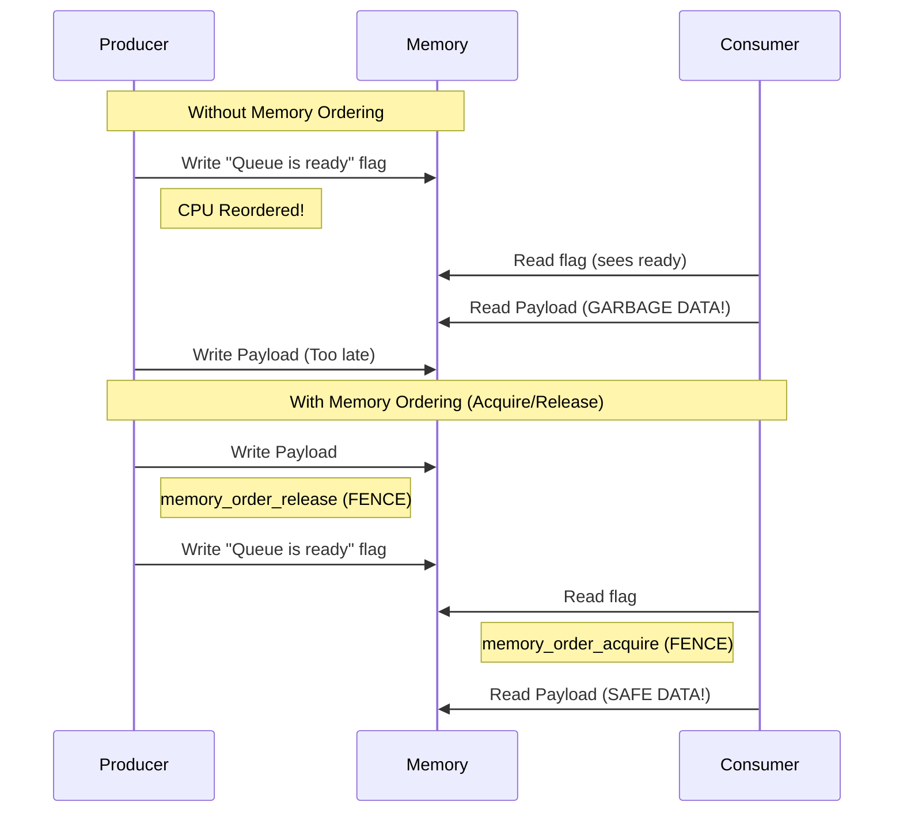

# Software Primitives & Concurrency

To overcome the hardware limitations discussed in the previous chapter, we must use precise software engineering techniques. This chapter explores the C++ concepts and concurrency primitives that allow our SPSC ring buffer to achieve wait-free progress.

## 1. Progress Guarantees (Wait-Freedom)

When building concurrent systems, "lock-free" is often used interchangeably with "fast," but computer science defines these with strict mathematical progress guarantees:

### Blocking Algorithms
Traditional multi-threading uses synchronization primitives like `std::mutex`. If Thread A acquires a lock and is preempted by the OS scheduler (put to sleep), Thread B blocks forever waiting for the lock. The entire system's progress halts.

### Non-Blocking: Lock-Free
Many high-performance queues rely on a `Compare-And-Swap` (CAS) operation in a `while` loop. The *system as a whole* makes progress, but a specific thread might fail its CAS loop thousands of times if other threads beat it. It is subject to starvation.

### Non-Blocking: Wait-Free (Our Architecture)
Wait-freedom is the strongest progress guarantee. *Every single thread* makes progress in a bounded number of steps, regardless of what any other thread is doing. 

Because we use a Single-Producer Single-Consumer (SPSC) design, exactly one thread modifies the `write_index_` and exactly one thread modifies the `read_index_`. There is no contention. We don't need CAS loops to resolve conflicts because conflicts are architecturally impossible. The operations complete in a fixed, predictable number of CPU cycles.

## 2. Atomics & Memory Ordering

Instead of asking the OS to lock data via a Mutex, we rely on the `<atomic>` library. An atomic operation is guaranteed by hardware to execute as a single, indivisible action.

To prevent the **Out-of-Order Execution** catastrophe, we use **Memory Ordering** to tell the CPU and compiler: *"Stop reordering right here. This specific sequence matters to other threads."*



### Acquire-Release Semantics
We establish a relationship between the Producer and the Consumer using Acquire/Release semantics:

```cpp
// PRODUCER:
data_[current_write] = item;
write_index_.store(next_write, std::memory_order_release);
```
**`memory_order_release`**: This tells the CPU, *"You must finish writing the data array to memory BEFORE you update `write_index`."*

```cpp
// CONSUMER:
if (current_read == write_index_.load(std::memory_order_acquire)) {
    return false; // Empty
}
item = data_[current_read];
```
**`memory_order_acquire`**: This tells the CPU, *"Do not attempt to read the data array until AFTER you have safely loaded the `write_index` from memory."*

By pairing an `acquire` with a `release`, we build an invisible memory fence that guarantees the Consumer will only ever see fully constructed payloads.

## 3. Memory Alignment with `alignas`

To prevent False Sharing, we dictate the memory alignment of our atomic variables using the C++11 `alignas` keyword combined with C++17's hardware queries:

```cpp
#if defined(__cpp_lib_hardware_interference_size)
    constexpr std::size_t CACHE_LINE_SIZE = std::hardware_destructive_interference_size;
#else
    constexpr std::size_t CACHE_LINE_SIZE = 64; // Standard x86
#endif

alignas(CACHE_LINE_SIZE) std::atomic<std::size_t> write_index_{0};
alignas(CACHE_LINE_SIZE) std::atomic<std::size_t> read_index_{0};
```
This queries the compiler directly for the target hardware's cache line size and forces the compiler to pad the struct, ensuring variables sit on distinct CPU cache lines.

## 4. Placement `new`

Standard `new` allocates memory on the general OS heap and then calls the constructor. **Placement `new`** separates these steps, allowing you to construct an object in memory you have *already* explicitly allocated.

We allocate memory specifically on a target NUMA node using OS-level APIs, and then we construct the C++ object into that exact memory space using placement `new` and variadic templates for perfect forwarding:

```cpp
void* memory = allocate_on_node(sizeof(T), node);
return new (memory) T(std::forward<Args>(args)...); // Placement new
```

## 5. Variadic Templates & Perfect Forwarding (`<utility>`)

Our `NumaMemoryUtils::create_on_node` factory function needs to construct objects of type `T`, but it doesn't know what `T`'s constructor looks like ahead of time.

*   **Variadic Templates (C++11)**: Allows a function or class to accept an arbitrary number of arguments of any type (`typename... Args`).
*   **Perfect Forwarding (`std::forward`)**: Ensures that arguments passed to a wrapper function preserve their original characteristics (l-value vs. r-value references) when passed to the underlying function.

```cpp
template <typename T, typename... Args>
T* create_on_node(int node, Args&&... args) {
    // ... allocate memory on node ...
    return new (memory) T(std::forward<Args>(args)...);
}
```
This pattern is heavily used whenever writing wrapper functions, factory classes, or custom allocators.

## 6. Native Thread Handles

The C++ `<thread>` library provides a cross-platform abstraction for OS threads, but CPU affinity/pinning is highly OS-specific. The `native_handle()` function allows us to access the underlying OS thread object (e.g., `pthread_t` on Linux) so we can pass it to Linux-specific functions like `pthread_setaffinity_np` to bind our threads to specific NUMA cores.
