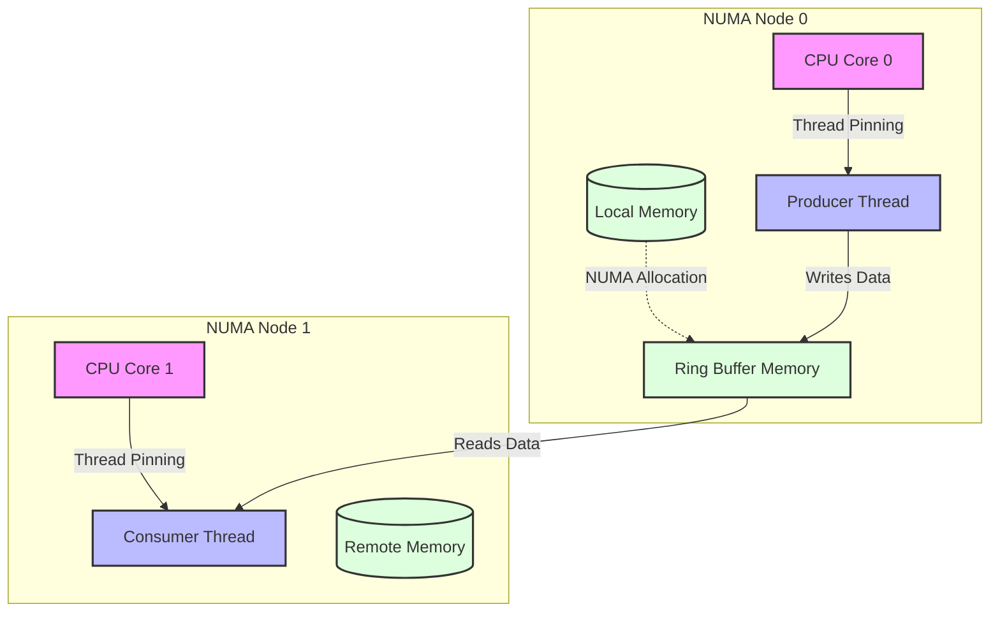
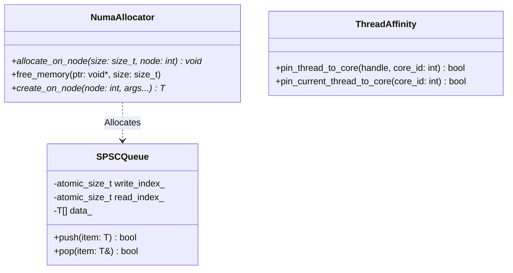
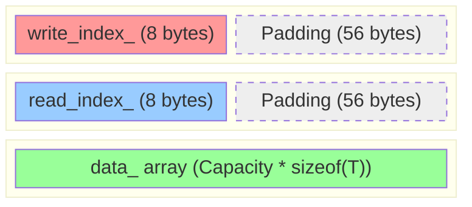

# System Design & Architecture Deep Dive

This section provides a detailed breakdown of the system design behind our high-performance NUMA-aware ring buffer. It is tailored for Computer Science students and professionals looking to understand how low-level hardware concepts influence software architecture.

## 1. Software Principles Followed

### Mechanical Sympathy
**Concept:** Writing code that works in harmony with the underlying hardware, rather than fighting it. It requires understanding how CPU caches, memory controllers, and interconnects operate.

**Real-World Analogy:** Imagine an industrial kitchen. If the chef has to walk across the kitchen for every spice, cooking takes forever. Mechanical sympathy is like organizing the kitchen so the most used spices are right next to the stove. In our code, we place critical variables on specific "cache lines" so the CPU doesn't waste time fetching them.

### Single Responsibility Principle (SRP)
**Concept:** Each module or class should have one, and only one, reason to change.

**Implementation in our project:**
- `SPSCQueue`: Solely handles the lock-free logic of enqueueing and dequeueing.
- `NumaAllocator`: Solely handles the memory allocation on specific NUMA nodes.
- `ThreadAffinity`: Solely manages the OS-level thread pinning.

### Zero-Copy & Lock-Free Design
**Concept:** Avoiding traditional locking mechanisms (like Mutexes) which put threads to sleep and cause OS context switches. Zero-copy means data isn't unnecessarily duplicated in memory.

**Real-World Analogy:** Think of a drive-thru. Instead of the cook stopping everything to hand food directly to the cashier (a "lock"), the cook slides the burger down a chute. The cashier grabs it from the chute when ready. Neither stops the other.

## 2. Design Patterns Used

### Producer-Consumer Pattern
Our core architecture is built around a Single-Producer, Single-Consumer (SPSC) pattern. 
- **Producer Thread:** Continuously writes data into the buffer.
- **Consumer Thread:** Continuously reads data from the buffer.

**Real-World Analogy:** A factory conveyor belt. One worker puts items on the belt (Producer), and another worker takes them off at the end (Consumer). The belt itself is the Ring Buffer.

### Custom Allocator Pattern
Instead of using the default system allocator (`new`/`malloc`), we implemented a custom NUMA allocator. This ensures that the memory for the queue is physically located on the RAM sticks closest to the CPU core that will access it.

### RAII (Resource Acquisition Is Initialization)
While dealing with low-level memory, we use RAII-like principles in our utility functions (e.g., `NumaMemoryUtils::create_on_node` and `destroy_and_free`) to ensure memory is properly cleaned up without memory leaks.

## 3. OS Concepts Involved

### Non-Uniform Memory Access (NUMA)
Modern multi-socket motherboards don't have a single pool of memory. Memory is divided into "Nodes", each attached directly to a specific CPU socket. Accessing local memory (on your own node) is fast. Accessing remote memory (on another node) is slow.

**Real-World Analogy:** Ordering food from a branch in your neighborhood vs. a branch across the city. Both are the same restaurant, but one takes much longer to deliver.

### CPU Pinning (Thread Affinity)
By default, the OS scheduler moves threads around different CPU cores to balance the load. However, moving a thread invalidates its cache. CPU pinning locks a thread to a specific core.

**Real-World Analogy:** Assigning a dedicated desk to an employee so they don't have to pack up their belongings and move to a new desk every hour.

### Cache Coherence and False Sharing
CPUs read memory in 64-byte chunks called "Cache Lines". If two threads modify different variables that happen to be on the same cache line, the hardware gets confused and constantly invalidates the cache, killing performance.

**Our Solution:** We use `alignas(64)` to force the `read_index_` and `write_index_` onto entirely separate cache lines.

### Memory Ordering & Atomics
Compilers and CPUs often reorder instructions for optimization. When multiple threads are involved, this can cause disaster. We use C++ atomics (`std::memory_order_release` and `std::memory_order_acquire`) to enforce strict ordering.

**Real-World Analogy:** Mailing a multi-part letter. You must guarantee the recipient receives and reads page 1 before page 2.

## 4. List of Use Cases

Where would you actually design and build a system like this?

1. **High-Frequency Trading (HFT):** Passing market data from a network-receiving thread to a trading-logic thread where every microsecond determines profit or loss.
2. **Real-time Audio/Video Processing:** Moving raw audio or video frames from a capture thread to an encoding thread without dropping frames or causing jitter.
3. **Network Packet Processing (e.g., DPDK):** Moving packets directly from the Network Interface Card (NIC) to user-space applications, bypassing the slow OS kernel.
4. **High-Performance Game Engines:** Passing entity updates between the main game loop thread and the physics/rendering threads.

## 5. High-Level Design (HLD)

The High-Level Design illustrates how the components of our system map to the physical hardware.

**Explanation:**
The Producer thread is pinned to Core 0 on Node 0. The Ring Buffer itself is specifically allocated on Node 0's local memory. This means the Producer has blazing fast, local memory access. The Consumer thread might be on Node 1, taking a slight hit for remote access, but the isolation prevents the threads from interfering with each other's L1/L2 caches.

## 6. Low-Level Design (LLD)

The Low-Level Design focuses on the internal structure of the `SPSCQueue` and how memory is laid out to prevent False Sharing.

### Component Architecture

*(Note: standard C++ templates are simplified here for readability)*

### Memory Layout & False Sharing Prevention

This is how our queue looks in physical RAM. By using `alignas(64)` (or the hardware destructive interference size), we force the compiler to add "padding" (empty wasted space) to ensure variables sit on their own dedicated hardware cache lines.

**Explanation:**
When the Producer updates `write_index_`, the CPU pulls "Cache Line 1" into the Producer's L1 cache. Because `read_index_` is physically located on "Cache Line 2", it is completely unaffected. The Consumer can simultaneously read/update `read_index_` without invalidating the Producer's cache, achieving true lock-free parallelism.
