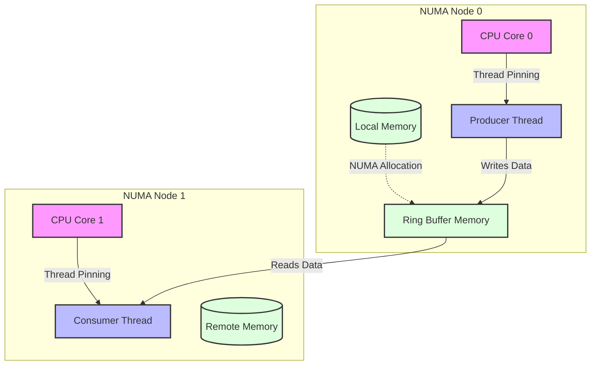
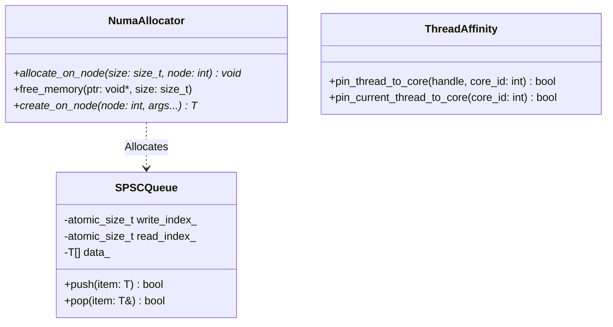
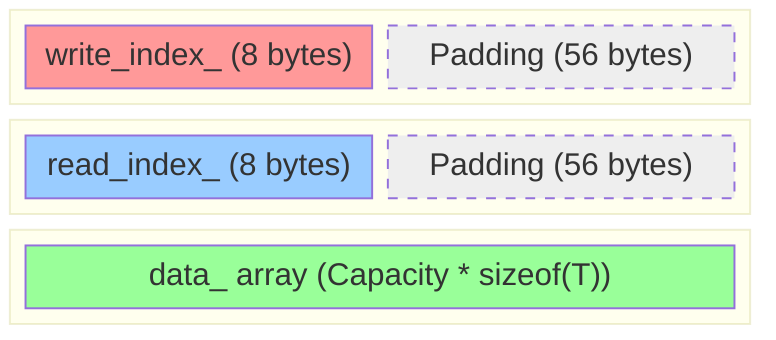

# System Design & Architecture

This chapter brings together the hardware realities and the software primitives to present the complete High-Level and Low-Level architecture of the NUMA-aware SPSC ring buffer.

## 1. Software Principles & Patterns

### The Data Structure: SPSC Ring Buffer

**What it is:** A Ring Buffer (or Circular Queue) is a fixed-size, contiguous memory array that treats memory as if it were circular. It uses two indices (or pointers): a `write_index` for adding elements and a `read_index` for removing them. The Single-Producer Single-Consumer (SPSC) variant restricts access so that exactly one thread produces data and exactly one thread consumes it. 

**Why it is used in this use case:** In High-Frequency Trading (HFT) and ultra-low latency systems, allocating memory dynamically (e.g., using `new` or `malloc`) during the critical path is prohibitively slow and can cause unpredictable latency spikes. A Ring Buffer avoids this by pre-allocating a continuous block of memory upfront. Furthermore, an SPSC queue naturally aligns with data pipeline architectures, such as a market data handler thread passing parsed ticks to an execution strategy thread.

**Why it is the best design selection:** The SPSC Ring Buffer is the optimal choice for this architecture because its constraints (one producer, one consumer) allow it to be entirely **lock-free and wait-free**. Since the producer only ever modifies the `write_index` and the consumer only ever modifies the `read_index`, they never contend for the same variables to make progress. When combined with NUMA-awareness and memory alignment (to prevent False Sharing), it allows continuous, contention-free data flow across CPU cores with strict deterministic latency bounds, outperforming any dynamic or multi-producer/multi-consumer lock-based alternatives.

### Single Responsibility Principle (SRP)
The system is cleanly divided into specific modules:
- `SPSCQueue`: Solely handles the lock-free, wait-free logic of enqueueing and dequeueing using modulo arithmetic.
- `NumaAllocator`: Solely handles explicitly mapping and allocating memory on specific physical NUMA nodes.
- `ThreadAffinity`: Solely manages the OS-level thread pinning using native pthread handles.

### The Algorithm: Modulo Arithmetic
Under the hood, the SPSC Ring Buffer is a Circular Array of a fixed, pre-allocated size. It does not grow or shrink dynamically, avoiding slow `malloc` or `new` calls during the critical path.

Instead of shifting data around when an item is removed (an $O(N)$ operation), the indices simply advance forward.
*   **Push (Enqueue):** The Producer writes data to `data_[write_index_]` and increments `write_index_`. If `write_index_` reaches the end of the array, it wraps around back to index 0 using modulo arithmetic (`next_write = (current_write + 1) % Capacity`).
*   **Pop (Dequeue):** The Consumer reads from `data_[read_index_]` and increments `read_index_`, also wrapping around to 0 when it hits the end.

## 2. High-Level Design (HLD)

The High-Level Design illustrates how the components of our system map to the physical hardware to avoid QPI/UPI interconnect latency.

**Explanation:**
The Producer thread is pinned to Core 0 on Node 0. The Ring Buffer itself is specifically allocated on Node 0's local memory using our `NumaAllocator`. This means the Producer has blazing fast, local memory access. The Consumer thread might be on Node 1, taking a slight hit for remote access, but the isolation prevents the threads from interfering with each other's L1/L2 caches.

## 3. Low-Level Design (LLD)

The Low-Level Design focuses on the internal structure of the `SPSCQueue` and how memory is laid out to prevent False Sharing.

### Component Architecture

### Memory Layout & False Sharing Prevention

This is how our queue looks in physical RAM. By using `alignas(CACHE_LINE_SIZE)`, we force the compiler to add "padding" (empty wasted space) to ensure variables sit on their own dedicated hardware cache lines.

**Explanation:**
When the Producer updates `write_index_`, the CPU pulls "Cache Line 1" into the Producer's L1 cache. Because `read_index_` is physically located on "Cache Line 2", it is completely unaffected. The Consumer can simultaneously read/update `read_index_` without triggering a MESI Invalid state on the Producer's cache, achieving true wait-free parallelism.
