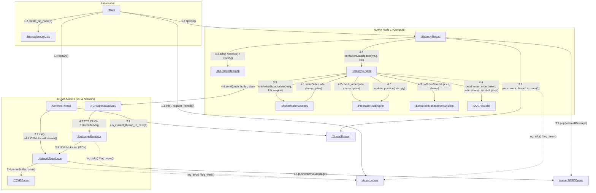

# Communication Diagram

This document contains the Communication Diagram (UML) for the `numa-portfolio` project, capturing the objects involved in the system and the numbered sequence of messages exchanged between them.

## Diagram Explanation

The UML Communication diagram above details the interactions between the primary components (instances) of the `numa-portfolio` system. The diagram emphasizes both the object connections and the sequential numbering of messages across the distributed architecture.

1. **Initialization (1.x)**: The `Main` thread sets up the globally accessible `AsyncLogger`, allocates the lock-free `SPSCQueue` specifically on NUMA Node 0 via `NumaMemoryUtils`, and spawns the worker threads (`StrategyThread` and `NetworkThread`).
2. **Network Thread Execution & Market Data Ingestion (2.x)**: `NetworkThread` pins itself to CPU core 0 using `ThreadPinning` and initiates the `NetworkEventLoop`. The `ExchangeEmulator` sends UDP multicast ITCH packets to the loop, which reads the data, parses it via `ITCH5Parser`, and pushes the result into the lock-free `SPSCQueue`.
3. **Strategy Thread Execution & Data Processing (3.x)**: The `StrategyThread` is pinned to CPU core 1. It spins by polling the `SPSCQueue` for market updates. It first updates the `LimitOrderBook` and then triggers the `StrategyEngine`, which subsequently triggers the `MarketMakerStrategy`.
4. **Order Generation & Execution Flow (4.x)**: Based on the update, the `MarketMakerStrategy` may call `sendOrder()` on the `StrategyEngine`. The engine then sequentially delegates tasks to `PreTradeRiskEngine` to validate the risk limits, `ExecutionManagementSystem` to track the outgoing order, and `OUCHBuilder` to encode the message. Finally, the TCP packets are sent via `TCPEgressGateway` to the `ExchangeEmulator`.
5. **Background Logging**: The dashed lines represent asynchronous logging sent from multiple system components to the `AsyncLogger` thread instance.
