# NUMA-Portfolio Activity Diagram

This document contains the detailed activity diagram of the `numa-portfolio` project, illustrating the complete end-to-end flow from system initialization, through the concurrent execution of the Network and Strategy threads, to market data processing, order evaluation, risk checks, and system shutdown.

```mermaid
flowchart TD

    %% Main Thread Initialization
    Start((Start Main)) --> InitLogger[Initialize AsyncLogger]
    InitLogger --> RegMainLog[Register Main Thread in Logger]
    RegMainLog --> AllocQueue["Allocate SPSCQueue on NUMA Node 0<br/>NumaMemoryUtils::create_on_node"]
    AllocQueue --> InitEgress[Initialize TCPEgressGateway]
    InitEgress --> SpawnNet[Spawn Network Thread]
    SpawnNet --> SpawnStrat[Spawn Strategy Thread]

    SpawnNet -.-> NetStart((Start Network Thread))
    SpawnStrat -.-> StratStart((Start Strategy Thread))

    %% Main thread waiting and shutdown
    SpawnStrat --> WaitInput["Main Thread: Wait for User Input Enter"]
    WaitInput --> UserInputEvent((User Presses Enter))
    UserInputEvent --> Shutdown["Set is_running = false"]
    Shutdown --> JoinStrat[Join Strategy Thread]
    JoinStrat --> DetachNet[Detach Network Thread]
    DetachNet --> FreeQueue["Free SPSCQueue Memory<br/>NumaMemoryUtils::destroy_and_free"]
    FreeQueue --> ShutLogger[Shutdown AsyncLogger]
    ShutLogger --> EndMain((End Main))

    %% Network Thread Flow
    subgraph NetworkThread["Network Thread - Core 0"]

        NetStart --> PinNet[Pin Thread to Core 0]
        PinNet --> RegNetLog[Register Network Thread in Logger]
        RegNetLog --> InitEventLoop[Initialize NetworkEventLoop]
        InitEventLoop --> AddTCP["Add TCP Client for Egress<br/>Connect to Simulator"]
        AddTCP --> SetEgressFD[Set Socket FD on TCPEgressGateway]
        SetEgressFD --> AddUDP["Add UDP Multicast Listener<br/>Listen for ITCH Data"]
        AddUDP --> RunLoop["Call loop.run()<br/>Block on Epoll"]

        RunLoop --> EpollWait{Wait for Network Events}

        EpollWait -- TCP Event --> ReadTCP["Read TCP Buffer<br/>OUCH Accepted/Executed"]
        ReadTCP --> EpollWait

        EpollWait -- UDP Event --> ReadUDP["Read UDP Buffer<br/>ITCH Data"]
        ReadUDP --> ParseITCH{"itch5::Parser::parse"}

        ParseITCH -- Invalid --> EpollWait
        ParseITCH -- Valid Message --> PushQueue{Push to SPSCQueue}

        PushQueue -- Queue Full --> SpinWait[Spin Wait]
        SpinWait --> PushQueue

        PushQueue -- Push Success --> EpollWait

    end

    %% Strategy Thread Flow
    subgraph StrategyThread["Strategy Thread - Core 1"]

        StratStart --> PinStrat[Pin Thread to Core 1]
        PinStrat --> RegStratLog[Register Strategy Thread in Logger]
        RegStratLog --> InitLOB[Initialize LimitOrderBook]
        InitLOB --> InitEMS[Initialize ExecutionManagementSystem]
        InitEMS --> InitRisk[Initialize PreTradeRiskEngine]
        InitRisk --> InitEngine[Initialize StrategyEngine]
        InitEngine --> AddStrategy[Add MarketMakerStrategy]

        AddStrategy --> LoopStart{"is_running == true?"}

        LoopStart -- No --> StratEnd((End Strategy Thread))

        LoopStart -- Yes --> PopQueue{Pop from SPSCQueue}

        PopQueue -- Empty --> YieldThread[Yield Thread]
        YieldThread --> LoopStart

        PopQueue -- Message Received --> SwitchType{Check Message Type}

        SwitchType -- Add --> LOBAdd["LOB: add()"]
        SwitchType -- Delete --> LOBCancel["LOB: cancel()"]
        SwitchType -- Modify --> LOBModify["LOB: modify()"]

        LOBAdd --> UpdateEngine
        LOBCancel --> UpdateEngine
        LOBModify --> UpdateEngine

        UpdateEngine["Call StrategyEngine::onMarketDataUpdate"]
            --> CallStrat["Call MarketMakerStrategy::onMarketDataUpdate"]

        CallStrat --> CheckPosTaken{"position_taken == true?"}

        CheckPosTaken -- Yes --> LoopStart

        CheckPosTaken -- No --> CheckCondition["Check Strategy Condition<br/>type == Add AND side == BUY<br/>AND price >= threshold_price"]

        CheckCondition -- Condition Not Met --> LoopStart

        CheckCondition -- Condition Met --> CallSendOrder["Call StrategyEngine::sendOrder"]

        CallSendOrder --> RiskCheck["Call PreTradeRiskEngine::check_order"]

        RiskCheck --> RiskEval{Evaluate Risk Rules}

        RiskEval -- Max Order Size Exceeded --> RejectOrder[Reject Order]
        RiskEval -- Price Deviation Exceeded --> RejectOrder
        RiskEval -- Max Position Exceeded --> RejectOrder

        RejectOrder --> LogReject[Log Warning]
        LogReject --> LoopStart

        RiskEval -- Approved --> UpdateEMS["Call ems_.onOrderSent()"]

        UpdateEMS --> BuildOUCH["Encode OUCH EnterOrderMsg<br/>OUCHBuilder::build_enter_order"]

        BuildOUCH --> EncodeCheck{Encoding Success?}

        EncodeCheck -- No --> LogEncodeError[Log Error]
        LogEncodeError --> LoopStart

        EncodeCheck -- Yes --> UpdateRiskPos["Call risk_engine_.update_position"]

        UpdateRiskPos --> TCPSend["Send via TCPEgressGateway::send"]

        TCPSend --> SetPosTaken["Set position_taken = true"]

        SetPosTaken --> LoopStart

    end

    %% Inter-thread Connections
    PushQueue -.->|Passes InternalMessage| PopQueue
    TCPSend -.->|Writes directly to Socket| ReadTCP
    StratEnd -.-> JoinStrat
```
