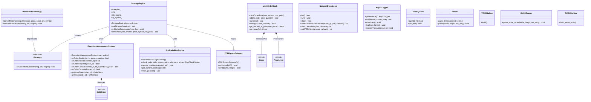

# HFT Project Class Diagram

This document contains a high-level class diagram of the HFT Local Project showcasing the core classes and their relationships.

```mermaid
classDiagram

    %% Core Interfaces and Strategies

    class IStrategy {
        <<interface>>
        +onMarketDataUpdate(msg, lob, engine) void
    }

    class MarketMakerStrategy {
        +MarketMakerStrategy(threshold_price, order_qty, symbol)
        +onMarketDataUpdate(msg, lob, engine) void
    }

    MarketMakerStrategy --|> IStrategy : Implements

    %% Engine and Core Components

    class StrategyEngine {
        -strategies_
        -ems_
        -risk_engine_
        -tcp_egress_
        +StrategyEngine(ems, risk, tcp)
        +addStrategy(strategy) void
        +onMarketDataUpdate(msg, lob) void
        +sendOrder(side, shares, price, symbol, ref_price) bool
    }

    StrategyEngine o-- IStrategy : Contains
    StrategyEngine --> ExecutionManagementSystem : Uses
    StrategyEngine --> PreTradeRiskEngine : Uses
    StrategyEngine --> TCPEgressGateway : Uses

    class ExecutionManagementSystem {
        +ExecutionManagementSystem(max_orders)
        +onOrderSent(order_id, price, quantity) bool
        +onOrderAccepted(order_id) bool
        +onOrderRejected(order_id) bool
        +onOrderExecuted(order_id, fill_quantity, fill_price) bool
        +onOrderCanceled(order_id) bool
        +getOrderState(order_id) OrderState
        +getOrder(order_id) EMSOrder
    }

    ExecutionManagementSystem *-- EMSOrder : Manages

    class EMSOrder {
        <<struct>>
    }

    class PreTradeRiskEngine {
        +PreTradeRiskEngine(config)
        +check_order(side, shares, price, reference_price) RiskCheckStatus
        +update_position(executed_qty) void
        +get_current_position() int64
        +reset_position() void
    }

    %% Order Book

    class LimitOrderBook {
        +LimitOrderBook(max_orders, max_price)
        +add(id, side, price, quantity) bool
        +cancel(id) bool
        +modify(id, new_quantity) bool
        +get_volume_at_price(side, price) uint64
        +get_order(id) Order
    }

    LimitOrderBook *-- Order : Memory Pool
    LimitOrderBook *-- PriceLevel : Price Arrays

    class Order {
        <<struct>>
    }

    class PriceLevel {
        <<struct>>
    }

    %% Networking and System Infrastructure

    class NetworkEventLoop {
        +init() bool
        +run() void
        +stop() void
        +addUDPMulticastListener(mcast_ip, port, callback) int
        +addTCPListener(port, callback) int
        +addTCPClient(ip, port, callback) int
    }

    class TCPEgressGateway {
        +TCPEgressGateway(fd)
        +setSocketFd(fd) void
        +send(buffer, length) bool
    }

    class AsyncLogger {
        +getInstance() AsyncLogger
        +init(filepath, mmap_size) void
        +shutdown() void
        +log(level, format) void
        +registerThread(thread_id) void
    }

    class SPSCQueue {
        +push(item) bool
        +pop(item) bool
    }

    %% Message Parsers and Builders

    class Parser {
        +parse_timestamp(ts) uint64
        +parse(buffer, length, out_msg) bool
    }

    class ITCH5Builder {
        +build()
    }

    class OUCHParser {
        +parse_enter_order(buffer, length, out_msg) bool
    }

    class OUCHBuilder {
        +build_enter_order()
    }
```
