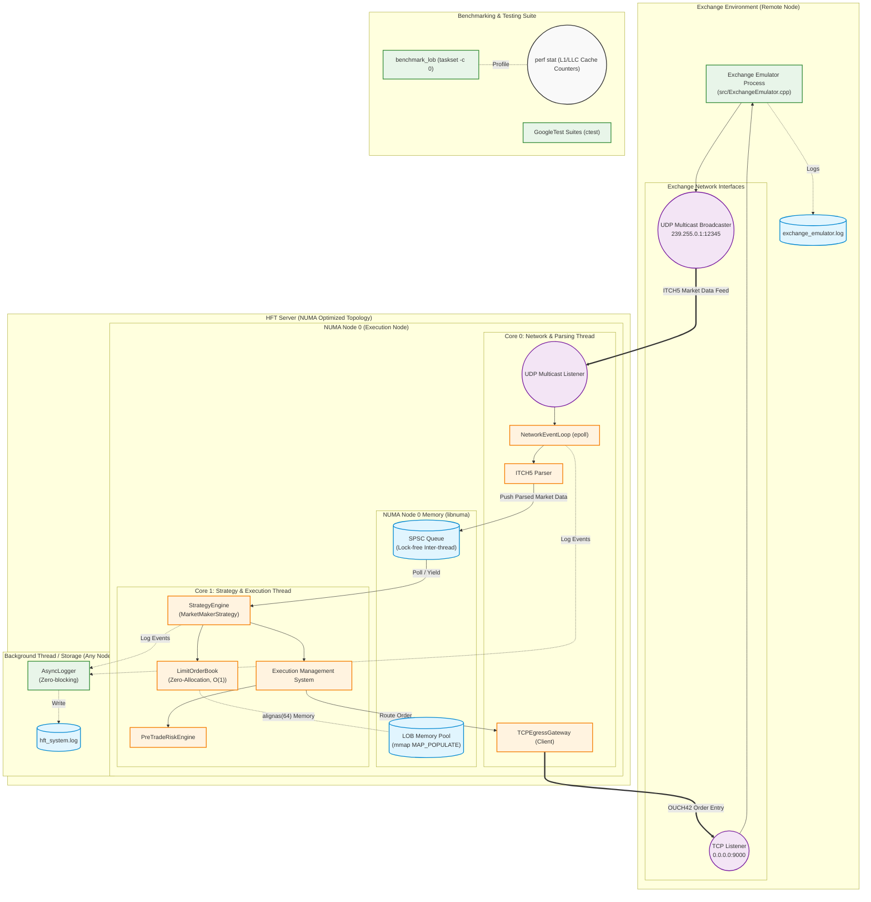

# Numa HFT Portfolio - Deployment Diagram

This deployment diagram illustrates the physical and logical architecture of the entire NUMA-aware High-Frequency Trading project. It captures the interaction between the exchange emulator and the core HFT system, highlighting the specific hardware topology, threading model, and network communications.

### Architecture Highlights:
- **Hardware Topology**: The system strictly maps specific responsibilities to physical CPU cores using `taskset` and `pthread_setaffinity_np` (Core 0 for Network, Core 1 for Strategy), ensuring maximum cache locality.
- **NUMA Memory Localization**: Both the SPSC queue and the memory-mapped Limit Order Book pool are strictly allocated on NUMA Node 0 to prevent cross-QPI interconnect latency during execution.
- **Network Boundaries**: 
  - Inbound market data travels over UDP Multicast (ITCH5 format).
  - Outbound execution orders travel over a direct TCP connection (OUCH42 format).
- **Asynchronous Logging**: All performance-critical threads defer logging to a non-blocking `AsyncLogger` to prevent I/O stalls during market data parsing or execution.
