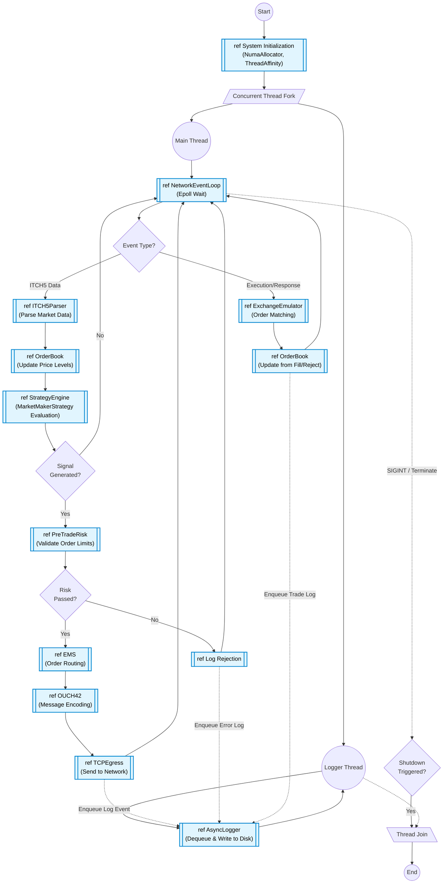

# Numa-Portfolio: Interaction Overview Diagram

An **Interaction Overview Diagram** provides a high-level, activity-diagram-like view of the flow of control across different interactions within a system. Each primary node (denoted by the `ref` subroutine shape) represents a distinct interaction or sequence diagram that encapsulates a specific functional phase of the `numa-portfolio` execution pipeline.

This diagram highlights:
- **Concurrent Execution:** The fork into the Main Thread Event Loop and the dedicated Asynchronous Logger Thread.
- **Interaction Uses:** The handoff between major system components, starting from Network Ingress, transitioning through the Strategy Engine, and concluding at Order Egress.
- **Conditional Control Flow:** Decision points for Order Generation, Pre-Trade Risk validation, and Event routing.

