# HFT Project Profile Diagram

This document contains the UML Profile Diagram for the HFT Local Project, showcasing the domain-specific stereotypes, tagged values, and constraints applied to the architecture. The diagram utilizes Mermaid's class diagram capabilities to represent the profile.

```mermaid
classDiagram
    direction TB

    %% ==========================================
    %% UML Metaclasses
    %% ==========================================
    class Class { <<metaclass>> }
    class Component { <<metaclass>> }
    class Interface { <<metaclass>> }
    class Struct { <<metaclass>> }

    %% ==========================================
    %% HFT Performance Profile (Stereotypes)
    %% ==========================================

    class LockFree {
        <<stereotype>>
        +bool waitFree
        +int cacheLineSize
        +bool padded
    }
    LockFree --|> Class : <<extend>>

    class NUMAAware {
        <<stereotype>>
        +int nodeID
        +bool strictBinding
        +bool preFaulted
    }
    NUMAAware --|> Class : <<extend>>
    NUMAAware --|> Component : <<extend>>

    class LowLatencyData {
        <<stereotype>>
        +bool memoryPooled
        +uint preallocatedCapacity
        +bool contiguous
    }
    LowLatencyData --|> Class : <<extend>>
    LowLatencyData --|> Struct : <<extend>>

    %% ==========================================
    %% Networking & I/O Profile (Stereotypes)
    %% ==========================================

    class NetworkIO {
        <<stereotype>>
        +string protocol
        +bool kernelBypass
        +bool zeroCopy
    }
    NetworkIO --|> Class : <<extend>>

    class Parser {
        <<stereotype>>
        +string format
        +int bufferSize
    }
    Parser --|> Class : <<extend>>

    %% ==========================================
    %% Trading Domain Profile (Stereotypes)
    %% ==========================================

    class TradingStrategy {
        <<stereotype>>
        +string primarySymbol
        +int maxPosition
    }
    TradingStrategy --|> Class : <<extend>>
    TradingStrategy --|> Interface : <<extend>>

    class HFTCore {
        <<stereotype>>
        +int maxLatencyNs
        +bool deterministic
    }
    HFTCore --|> Component : <<extend>>
    HFTCore --|> Class : <<extend>>

    class SystemInfrastructure {
        <<stereotype>>
        +bool daemon
    }
    SystemInfrastructure --|> Class : <<extend>>

    class Simulator {
        <<stereotype>>
        +bool deterministicReplay
    }
    Simulator --|> Class : <<extend>>

    %% ==========================================
    %% Application of Profile to Codebase
    %% ==========================================

    %% Applying LockFree
    class SPSCQueue { <<LockFree>> }
    SPSCQueue ..> LockFree : <<apply>>

    class AsyncLogger { <<LockFree>> }
    AsyncLogger ..> LockFree : <<apply>>

    %% Applying NUMAAware
    class NumaAllocator { <<NUMAAware>> }
    NumaAllocator ..> NUMAAware : <<apply>>

    class ThreadAffinity { <<NUMAAware>> }
    ThreadAffinity ..> NUMAAware : <<apply>>

    %% Applying LowLatencyData
    class OrderBook { <<LowLatencyData>> }
    OrderBook ..> LowLatencyData : <<apply>>

    class Payload { <<LowLatencyData>> }
    Payload ..> LowLatencyData : <<apply>>

    %% Applying TradingStrategy
    class MarketMakerStrategy { <<TradingStrategy>> }
    MarketMakerStrategy ..> TradingStrategy : <<apply>>
    
    class IStrategy { <<TradingStrategy>> }
    IStrategy ..> TradingStrategy : <<apply>>

    %% Applying NetworkIO
    class NetworkEventLoop { <<NetworkIO>> }
    NetworkEventLoop ..> NetworkIO : <<apply>>

    class TCPEgress { <<NetworkIO>> }
    TCPEgress ..> NetworkIO : <<apply>>

    %% Applying Parser
    class ITCH5Parser { <<Parser>> }
    ITCH5Parser ..> Parser : <<apply>>

    class OUCH42 { <<Parser>> }
    OUCH42 ..> Parser : <<apply>>

    %% Applying HFTCore
    class EMS { <<HFTCore>> }
    EMS ..> HFTCore : <<apply>>

    class PreTradeRisk { <<HFTCore>> }
    PreTradeRisk ..> HFTCore : <<apply>>

    class StrategyEngine { <<HFTCore>> }
    StrategyEngine ..> HFTCore : <<apply>>

    %% Applying SystemInfrastructure
    class TSCUtils { <<SystemInfrastructure>> }
    TSCUtils ..> SystemInfrastructure : <<apply>>

    class Main { <<SystemInfrastructure>> }
    Main ..> SystemInfrastructure : <<apply>>

    %% Applying Simulator
    class ExchangeEmulator { <<Simulator>> }
    ExchangeEmulator ..> Simulator : <<apply>>
```

