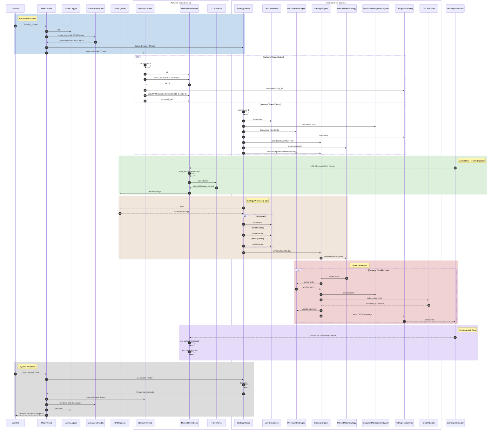

# Sequence Diagram

This document contains the detailed sequence diagram visualizing the execution flows and dynamic interactions of the `numa-portfolio` High-Frequency Trading (HFT) system.

```mermaid
sequenceDiagram
    autonumber
 
    participant OS as User/OS
    participant MT as MainThread
    participant Log as AsyncLogger
    participant Numa as NumaMemoryUtils
    participant SQ as SPSCQueue
 
    box Network Core (Core 0)
        participant NT as NetworkThread
        participant EventLoop as NetworkEventLoop
        participant Parser as ITCH5Parser
    end
 
    box Strategy Core (Core 1)
        participant ST as StrategyThread
        participant LOB as LimitOrderBook
        participant Risk as PreTradeRiskEngine
        participant SE as StrategyEngine
        participant MMS as MarketMakerStrategy
        participant EMS as ExecutionManagementSystem
        participant TCP as TCPEgressGateway
        participant OUCH as OUCHBuilder
    end
 
    participant Exch as ExchangeSimulator
 
    rect rgb(200,220,240)
        note right of OS: System Initialization
        OS->>MT: Start hft_system
        MT->>Log: init
        MT->>Numa: create_on_node SPSCQueue
        Numa-->>MT: Queue allocated on NUMA 0
        MT->>ST: Spawn Strategy Thread
        MT->>NT: Spawn Network Thread
    end
 
    par Network Thread Setup
        NT->>NT: pin to core 0
        NT->>EventLoop: init
        NT->>EventLoop: addTCPClient 127.0.0.1:9000
        EventLoop-->>NT: tcp_fd
        NT->>TCP: setSocketFd tcp_fd
        NT->>EventLoop: addUDPMulticastListener 239.255.0.1:12345
        NT->>EventLoop: run epoll_wait
    and Strategy Thread Setup
        ST->>ST: pin to core 1
        ST->>LOB: Instantiate
        ST->>EMS: Instantiate 10000
        ST->>Risk: Instantiate RiskConfig
        ST->>TCP: Instantiate
        ST->>SE: Instantiate EMS Risk TCP
        ST->>MMS: Instantiate AAPL
        ST->>SE: addStrategy MarketMakerStrategy
    end
 
    rect rgb(220,240,220)
        note right of Exch: Market Data - ITCH5 Ingestion
        Exch-->>EventLoop: UDP Multicast ITCH Packet
        EventLoop->>EventLoop: epoll_wait unblocks recv
        EventLoop->>Parser: parse buffer
        Parser-->>EventLoop: InternalMessage parsed
        EventLoop->>SQ: push message
    end
 
    rect rgb(240,230,220)
        note right of ST: Strategy Processing Spin
        ST->>SQ: pop
        SQ-->>ST: InternalMessage
 
        alt Add order
            ST->>LOB: add order
        else Delete order
            ST->>LOB: cancel order
        else Modify order
            ST->>LOB: modify order
        end
 
        ST->>SE: onMarketDataUpdate
        SE->>MMS: onMarketDataUpdate
    end
 
    rect rgb(240,210,210)
        note right of MMS: Order Generation
        opt Strategy Condition Met
            MMS->>SE: sendOrder
            SE->>Risk: check_order
            Risk-->>SE: APPROVED
            SE->>EMS: onOrderSent
            SE->>OUCH: build_enter_order
            OUCH-->>SE: Encoding successful
            SE->>Risk: update_position
            SE->>TCP: send OUCH message
            TCP-->>Exch: EnterOrder
        end
    end
 
    rect rgb(230,220,250)
        note right of Exch: Exchange Ack Flow
        Exch-->>EventLoop: TCP Packet Accepted/Executed
        EventLoop->>EventLoop: tcp_callback triggered
        EventLoop->>EventLoop: recv bytes and log
    end
 
    rect rgb(220,220,220)
        note right of OS: System Shutdown
        OS->>MT: User presses Enter
        MT->>ST: is_running = false
        ST->>ST: Exit spin
        ST-->>MT: thread join complete
        MT->>NT: detach network thread
        MT->>Numa: destroy_and_free queue
        MT->>Log: shutdown
        MT-->>OS: Graceful shutdown complete
    end
```