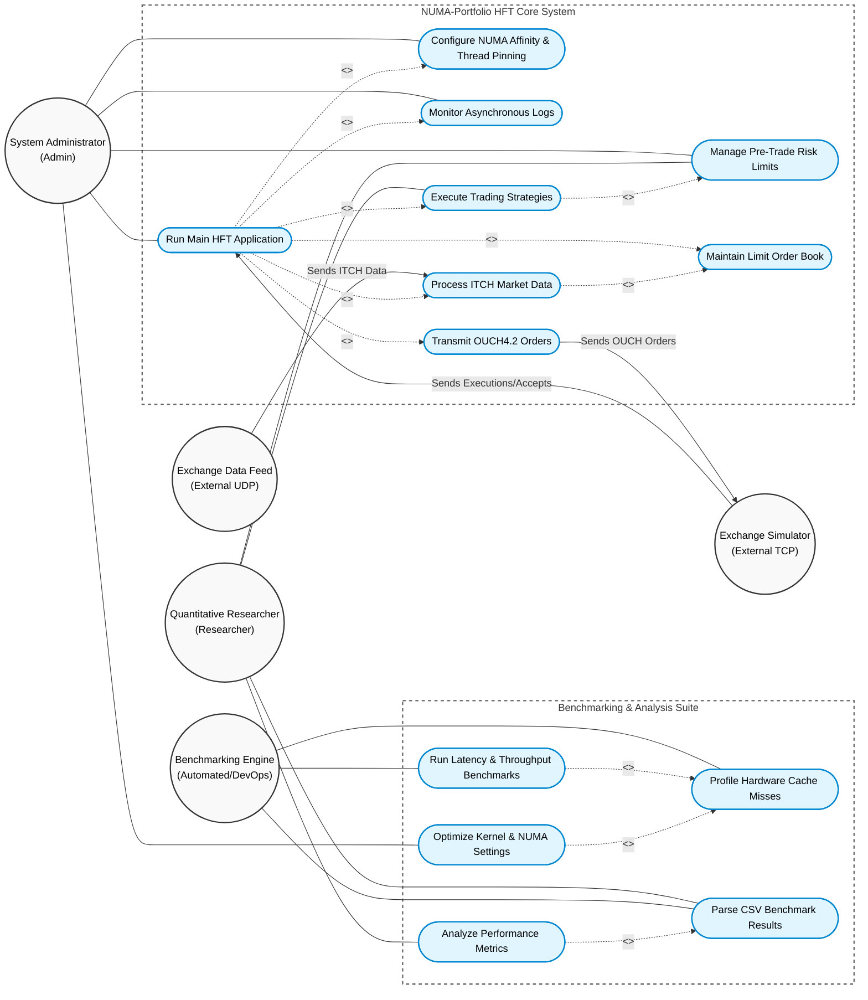

# NUMA-Portfolio Use Case Diagram

This document contains the comprehensive Use Case Diagram for the `numa-portfolio` project, illustrating the key actors (both human and external systems) and their interactions with the system's core functionalities, benchmarking suites, and high-frequency trading capabilities.

## Description of Actors

1. **System Administrator**: Responsible for deploying the system, configuring NUMA node affinity, pinning threads to specific CPU cores, setting risk boundaries, and monitoring system health via the asynchronous logger.
2. **Quantitative Researcher**: Focuses on designing, implementing, and analyzing trading strategies (like Market Maker), configuring strategy thresholds, and reviewing post-run data parsed from benchmarks to inform further logic improvements.
3. **Benchmarking Engine**: An automated runner (e.g., `benchmark_runner.py`) or DevOps workflow that executes targeted micro-benchmarks, measures TSC latencies, and uses tools like `perf stat` to evaluate L1/LLC cache misses.
4. **Exchange Data Feed (External UDP)**: The external venue broadcasting market data via UDP multicast (ITCH5 protocol).
5. **Exchange Simulator (External TCP)**: The external venue simulator accepting order flow over TCP connections (OUCH4.2 protocol) and providing fill/reject acknowledgments.
