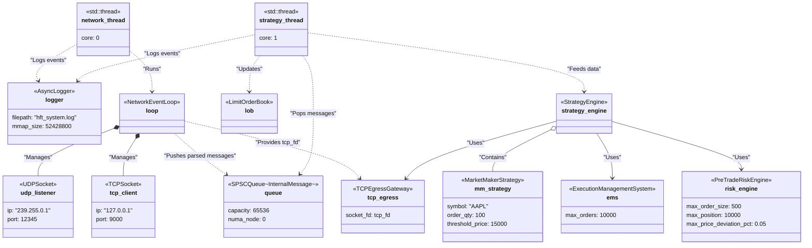

# HFT Project Object Diagram

This diagram represents a runtime snapshot of the HFT Local Project as instantiated in `Main.cpp`. It illustrates the key object instances, their thread affinity, and their relationships during system execution.

## Details of the Object Instantiation

- **AsyncLogger (`logger`)**: A singleton instance initialized early in the main thread with a 50MB memory-mapped file (`hft_system.log`). Both the `strategy_thread` and `network_thread` register themselves with this logger.
- **SPSCQueue (`queue`)**: Allocated explicitly on NUMA Node 0 to ensure fast access for the network thread. It serves as the primary lock-free message bus transferring parsed ITCH messages from the `network_thread` to the `strategy_thread`.
- **TCPEgressGateway (`tcp_egress`)**: Instantiated in the main thread but relies on the `network_thread` to establish a TCP connection to the exchange emulator (port 9000) and provide the valid socket file descriptor. It is later used by the `strategy_engine` to send orders.
- **Network Thread**: Pinned to CPU Core 0. It runs the `NetworkEventLoop` (`loop`), which listens to a multicast UDP stream for market data and maintains a TCP connection for order entry.
- **Strategy Thread**: Pinned to CPU Core 1. It initializes and owns the core trading instances:
  - **LimitOrderBook (`lob`)**: Maintains the state of the market based on messages popped from the `queue`.
  - **ExecutionManagementSystem (`ems`)**: Tracks the state of up to 10,000 active orders.
  - **PreTradeRiskEngine (`risk_engine`)**: Initialized with specific risk parameters (max order 500, max position 10000, 5% deviation limit).
  - **StrategyEngine (`strategy_engine`)**: The central coordinator that owns the `MarketMakerStrategy` (`mm_strategy`) configured to trade AAPL with a quantity of 100 and a threshold price of 15000. It routes market data from the `lob` to the strategy and routes resulting orders through the `risk_engine`, `ems`, and `tcp_egress`.
