# NUMA-Portfolio Package Diagram

The following class/package diagram details the module structure and runtime inter-package dependencies of the `numa-portfolio` high-frequency trading (HFT) project. The system is logically grouped into explicit namespaces reflecting core logic, wire protocol parsers, risk management, and low-level hardware optimization utilities.

```mermaid
classDiagram
    %% Core HFT Package
    namespace HFT {
        class StrategyEngine {
            +run()
            +onTick(MarketDataTick tick)
            +submitOrder(...)
        }
        class IStrategy {
            <<interface>>
            +onTick(MarketDataTick tick)
            +onOrderUpdate(...)
        }
        class MarketMakerStrategy {
            -target_spread
            -inventory
            +onTick(MarketDataTick tick)
        }
        class ExecutionManagementSystem {
            +routeOrder()
            +cancelOrder()
        }
        class TCPEgressGateway {
            +sendData()
            +connect()
        }
        class AsyncLogger {
            +log()
            +flush()
        }
        class NetworkEventLoop {
            +poll()
            +register_fd()
        }
    }

    %% ITCH5 Parser Package
    namespace itch5 {
        class Parser {
            +parse_buffer()
            +process_message()
        }
        class ITCH5Builder {
            +build()
        }
    }

    %% OUCH4.2 Protocol Package
    namespace ouch42 {
        class OUCHParser {
            +parse()
        }
        class OUCHBuilder {
            +build_enter_order()
            +build_cancel_order()
        }
    }

    %% Risk Management Package
    namespace risk {
        class PreTradeRiskEngine {
            +validateOrder()
            +checkExposure()
        }
    }

    %% NUMA Memory Utilities Package
    namespace NumaMemoryUtils {
        class NumaAllocator {
            <<namespace functions>>
            +allocate_on_node()
            +free_memory()
            +create_on_node()
            +destroy_and_free()
        }
    }

    %% Threading & OS Utilities Package
    namespace ThreadPinning {
        class ThreadAffinity {
            <<namespace functions>>
            +pin_thread_to_core()
            +pin_current_thread_to_core()
        }
    }

    %% Hardware Timestamp Utilities Package
    namespace TSCUtils {
        class TimeStampCounter {
            <<namespace functions>>
            +read_tsc()
            +estimate_tsc_frequency_hz()
            +cycles_to_nanoseconds()
        }
    }

    %% Global Data Structures Package
    namespace Global {
        class LimitOrderBook {
            +addOrder()
            +cancelOrder()
            +executeOrder()
        }
        class Order {
            +id
            +price
            +quantity
        }
        class MarketDataTick {
            +symbol
            +price
            +size
            +timestamp
            +creation_tsc
        }
        class SPSCQueue~T~ {
            +push()
            +pop()
        }
    }

    %% Application Entry Points
    class Main {
        <<executable>>
        +main()
    }
    class ExchangeEmulator {
        <<executable>>
        +main()
    }

    %% Package Dependencies and Class Relationships
    
    %% HFT Core Internal & External Dependencies
    StrategyEngine *-- IStrategy : Orchestrates (Dependency Injection)
    StrategyEngine *-- ExecutionManagementSystem : Routes orders via EMS
    StrategyEngine *-- PreTradeRiskEngine : Validates orders
    StrategyEngine *-- TCPEgressGateway : Pushes bits to network
    StrategyEngine --> LimitOrderBook : Queries Market State
    StrategyEngine ..> ThreadAffinity : Configures Strategy Thread
    
    MarketMakerStrategy ..|> IStrategy : Implements
    MarketMakerStrategy --> StrategyEngine : Issues execution commands
    
    ExecutionManagementSystem ..> OUCHBuilder : Formats messages (OUCH 4.2)
    ExecutionManagementSystem --> TCPEgressGateway : Forwards to Exchange
    
    AsyncLogger o-- SPSCQueue~T~ : Uses Lock-Free Ring Buffer
    AsyncLogger ..> TimeStampCounter : Latency Tracking (TSC)
    AsyncLogger ..> ThreadAffinity : Pins background thread
    
    NetworkEventLoop ..> Parser : Feeds Raw Ingress Data
    NetworkEventLoop ..> OUCHParser : Feeds Order Acks
    NetworkEventLoop ..> ThreadAffinity : Fast-path Polling Setup
    
    %% Protocol Dependencies
    Parser ..> MarketDataTick : Emits ticks
    Parser ..> LimitOrderBook : Mutates LOB directly
    
    %% Hardware Memory Topology
    LimitOrderBook ..> NumaAllocator : Topology-aware Allocations
    SPSCQueue~T~ ..> NumaAllocator : Node-local Allocations
    
    %% Application Bootstrapping
    Main ..> StrategyEngine : Initializes
    Main ..> NetworkEventLoop : Orchestrates
    Main ..> AsyncLogger : Sets up Logger Subsystem
    Main ..> MarketMakerStrategy : Configures Strategy
    Main ..> NumaAllocator : Bootstraps Topology
    
    ExchangeEmulator ..> NetworkEventLoop : Mocks Exchange Polling
    ExchangeEmulator ..> ITCH5Builder : Broadcasts Fake Market Data
```

