# System State Machine Diagrams

This document contains comprehensive State Machine diagrams for the High-Frequency Trading (HFT) system, capturing the lifecycles and behaviors of the various components in the `numa-portfolio` codebase.

```mermaid
stateDiagram-v2
    direction TB
    
    state "System Lifecycle (Main.cpp)" as SystemLifecycle {
        [*] --> Initializing : Start System
        Initializing --> Running : Thread Initialization Complete
        Running --> ShuttingDown : Stop Signal (is_running = false)
        ShuttingDown --> [*] : Threads Joined & Memory Freed
    }
    
    state "Network Event Loop (epoll)" as NetworkLoop {
        [*] --> EventLoopIdle
        EventLoopIdle --> Polling : run() called
        Polling --> Dispatching : epoll_wait() returns ready FDs
        Dispatching --> Polling : I/O callbacks executed
        Polling --> EventLoopStopped : stop() called (running_ = false)
        EventLoopStopped --> [*]
    }

    state "Pre-Trade Risk Engine" as RiskEngine {
        [*] --> PendingRiskCheck : sendOrder()
        PendingRiskCheck --> APPROVED : All checks pass
        PendingRiskCheck --> REJECTED_FAT_FINGER : Price deviation exceeds max_price_deviation_pct
        PendingRiskCheck --> REJECTED_MAX_ORDER_SIZE : Shares > max_order_size
        PendingRiskCheck --> REJECTED_MAX_POSITION : Current position + shares > max_position
        
        APPROVED --> [*]
        REJECTED_FAT_FINGER --> [*]
        REJECTED_MAX_ORDER_SIZE --> [*]
        REJECTED_MAX_POSITION --> [*]
    }
    
    state "Market Maker Strategy" as MMStrategy {
        [*] --> WaitingForMarketData
        WaitingForMarketData --> EvaluatingOpportunity : onMarketDataUpdate()
        EvaluatingOpportunity --> WaitingForMarketData : Suboptimal conditions / Max position
        EvaluatingOpportunity --> InitiatingOrder : Threshold met (e.g., hit the bid)
        InitiatingOrder --> RiskCheck : check_order()
        RiskCheck --> OrderSent : Risk APPROVED
        RiskCheck --> WaitingForMarketData : Risk REJECTED
        OrderSent --> PositionTaken : EMS update & OUCH transmission
        OrderSent --> WaitingForMarketData : Encoding failed
        PositionTaken --> WaitingForMarketData
    }

    state "Order Execution Management (EMSOrder State)" as OrderState {
        [*] --> NONE : Order created
        NONE --> PENDING_NEW : onOrderSent()
        
        PENDING_NEW --> NEW : onOrderAccepted()
        PENDING_NEW --> REJECTED : onOrderRejected()
        
        NEW --> PARTIALLY_FILLED : onOrderExecuted() [Partial Qty]
        NEW --> FILLED : onOrderExecuted() [Full Qty]
        
        PARTIALLY_FILLED --> PARTIALLY_FILLED : onOrderExecuted() [Partial Qty]
        PARTIALLY_FILLED --> FILLED : onOrderExecuted() [Full Qty]
        
        NEW --> CANCELED : onOrderCanceled()
        PARTIALLY_FILLED --> CANCELED : onOrderCanceled()
        
        FILLED --> [*]
        CANCELED --> [*]
        REJECTED --> [*]
    }

```

