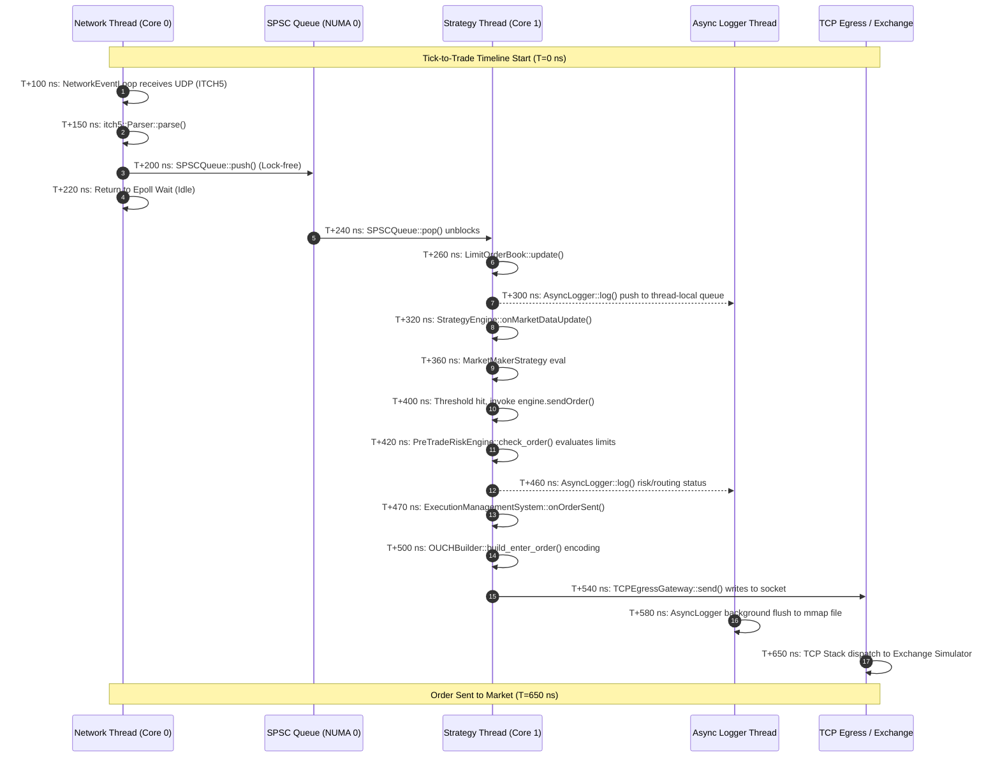

# HFT System Timing Diagram

This document contains the timing and execution flow diagrams for the `numa-portfolio` high-frequency trading (HFT) system. The diagrams illustrate the exact sequence of events, concurrency points, and the continuous timeline from the moment a market data tick is received on the network interface to the moment an order is dispatched to the exchange.

## 1. Tick-to-Trade Execution Timeline (Gantt Chart)

A high-resolution timeline (simulated in nanoseconds) showing the concurrent thread execution states and the critical path of the tick-to-trade workflow.

```mermaid
gantt
    title System Timing Diagram: Tick-to-Trade Path (Nanoseconds)
    dateFormat  X
    axisFormat %s ns

    section Network Thread (Core 0)
    Idle (Epoll Wait)                 :a1, 0, 100
    UDP Payload Rcvd (ITCH)           :crit, a2, 100, 150
    Parse ITCH Message                :a3, 150, 200
    Push to SPSC Queue                :a4, 200, 220
    Idle (Epoll Wait)                 :a5, 220, 1000

    section SPSC Queue
    Empty Buffer                      :q1, 0, 200
    Write Msg                         :crit, q2, 200, 220
    Msg Available                     :q3, 220, 240
    Read Msg                          :crit, q4, 240, 260
    Empty Buffer                      :q5, 260, 1000

    section Strategy Thread (Core 1)
    Spin Wait (Queue Empty)           :s1, 0, 240
    Pop Queue (Msg Rcvd)              :crit, s2, 240, 260
    Update Limit Order Book           :s3, 260, 320
    Strategy Engine Eval              :s4, 320, 360
    MarketMaker Strategy Eval         :crit, s5, 360, 420
    PreTrade Risk Checks              :s6, 420, 470
    EMS Order Routing                 :s7, 470, 500
    Encode OUCH4.2 Message            :s8, 500, 540
    TCP Egress Gateway Tx             :crit, s9, 540, 580
    Spin Wait (Queue Empty)           :s10, 580, 1000

    section Async Logger Thread
    Spin Wait (Poll Queues)           :l1, 0, 320
    Log ITCH Rcvd (Lock-free)         :l2, 320, 370
    Log Strategy Engine Eval          :l3, 420, 470
    Log Order Sent (Mmap Write)       :l4, 580, 680
    Spin Wait                         :l5, 680, 1000

    section Exchange Network
    Idle                              :e1, 0, 580
    TCP Kernel Tx Routing             :e2, 580, 650
    Wire Transmission (Exchange)      :crit, e3, 650, 800
```

## 2. Event Sequence Timing Diagram

A state-level sequential overview highlighting the time deltas between major architectural component calls.

